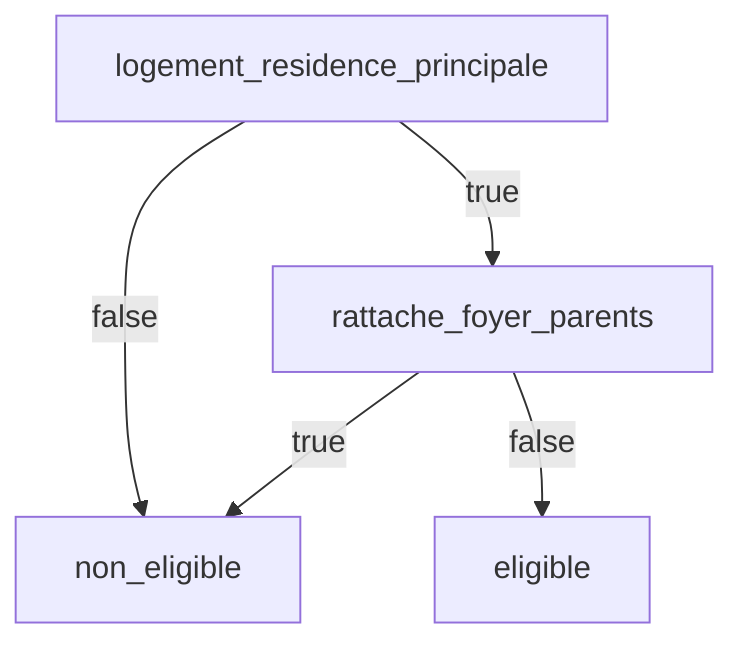

# Modéliser une aide publique

Modéliser une aide, c’est passer du **texte réglementaire** à une **représentation logique** exploitable par le code. Cette étape est délicate : elle exige de comprendre la règle, de la découper, puis de la traduire sans en altérer le sens.

> La modélisation est à la fois un acte juridique, conceptuel et technique.  
> C’est ici que le droit devient calculable.

## 1. Comprendre la règle avant de la formaliser

Avant toute modélisation, il faut **clarifier la source** et le **périmètre** de la règle.

### Identifier les sources primaires
- Textes législatifs et réglementaires (lois, décrets, arrêtés)  
- Instructions ministérielles ou circulaires  
- Documentation technique des opérateurs (CAF, Pôle emploi, etc.)  

> Chaque modèle devrait mentionner explicitement la **source primaire** de chaque condition.

### Recueillir des sources secondaires
- Articles explicatifs (service-public.fr, sites spécialisés)
- Documentation d'organismes (CAF, Pôle emploi, etc.).

::: warning Attention aux sources
Privilégiez toujours les sources officielles. Les sources de seconde main peuvent contenir des simplifications ou des erreurs.
:::

### Analyser le texte réglementaire

1. **Identifier les conditions d'éligibilité** : Qui peut bénéficier de l'aide ?
2. **Repérer les modalités de calcul** : Comment le montant est-il déterminé ?
3. **Lister les exceptions** : Quels sont les cas particuliers ?
4. **Définir les temporalités** : Quand s'applique la règle ?

## 2. Décomposer la règle en variables

À cette étape, on se concentre sur l'identification de **toutes les variables** nécessaires au calcul, sans se préoccuper de l'expérience utilisateur :

| Type de variable | Exemple | Description |
|------------------|----------|--------------|
| **Entrée (input)** | âge, revenus, résidence | Saisie par l’usager ou fournie par un service externe |
| **Référence (constante)** | barème, plafond, taux | Issue du texte réglementaire, souvent mise à jour annuellement |
| **Intermédiaire (calculée)** | quotient familial, revenu net | Déduite d’autres variables selon une formule |
| **Sortie (output)** | éligibilité, montant simulé | Résultat final affiché ou transmis |
| **Temporelle** | année fiscale, date de demande | Permet de gérer l’évolution des règles dans le temps |

Chaque variable doit être documentée avec :
- son **nom clair et cohérent** (en français ou en camelCase selon le moteur choisi) ;
- son **type** (booléen, numérique, textuel, date…) ;
- sa **source** et sa **dernière mise à jour**.

## 3. Formaliser les conditions logiques

Une fois les variables identifiées, on traduit les règles en **conditions logiques**.

### Exemple (APL étudiant)
> Article R.351-3 du Code de la construction et de l’habitation :  
> « Le demandeur doit occuper le logement à titre de résidence principale et ne pas être rattaché au foyer fiscal de ses parents. »

Traduction logique :

Le modèle n’est pas encore du code exécutable, mais il est déjà un objet partagé entre juristes, designers et développeurs.

## Du modèle au parcours utilisateur

### Ordonnancement des questions

Une fois les variables identifiées, il faut déterminer :

1. **L'ordre optimal** des questions (du général au particulier)
2. **Les conditions d'affichage** (questions conditionnelles)
3. **Les regroupements logiques** (par thème)
4. **Les points de sortie** (élimination précoce)

### Formulation user-friendly

Il faut rransformer le langage juridique en questions compréhensibles :

| Langage juridique | Formulation utilisateur |
|-------------------|-------------------------|
| "Personne isolée au sens de l'article L.262-2" | "Vivez-vous seul(e) ?" |
| "Revenus d'activité perçus au cours de l'année N-1" | "Quel était votre salaire l'année dernière ?" |

### Représentation visuelle

- **Arbres de décision** : Pour les logiques conditionnelles simples
- **Diagrammes de flux** : Pour les parcours complexes
- **Cartes mentales** : Pour organiser les variables par thème

### Outils numériques

- **Miro/Figma** : Collaboration visuelle en équipe
- **Lucidchart** : Diagrammes professionnels
- **Mermaid** : Diagrammes en code (versionnables)

## Exemple pratique

### Aide au logement étudiante

**Texte réglementaire** (simplifié) :
> "L'aide est accordée aux étudiants de moins de 28 ans, en formation initiale, dont les ressources ne dépassent pas X€, résidant dans un logement autonome de moins de Y m²"

**Variables identifiées** :
- `age_etudiant` (nombre)
- `type_formation` (énumération)
- `revenus_foyer` (montant)
- `type_logement` (énumération)
- `surface_logement` (nombre)

**Parcours utilisateur** :
1. "Quel est votre âge ?" → Élimination si > 28 ans
2. "Êtes-vous en formation initiale ?" → Élimination si non
3. "Quel type de logement occupez-vous ?" → Élimination si non autonome
4. "Quelle est la surface de votre logement ?" → Élimination si > Y m²
5. "Quels sont vos revenus ?" → Calcul du montant

## Bonnes pratiques

### Validation métier
- Faire relire par un expert de l'aide modélisée
- Tester avec des cas réels
- Documenter les choix d'interprétation

### Documentation
- Tracer la correspondance variable ↔ article de loi
- Justifier les simplifications éventuelles
- Maintenir une liste des cas non couverts

### Évolutivité
- Anticiper les évolutions réglementaires probables
- Structurer le modèle pour faciliter les mises à jour
- Séparer les données (barèmes) de la logique

::: tip Conseil pratique
Commencez par modéliser les cas les plus fréquents (80% des situations) avant de traiter les cas particuliers.
:::

## Prochaines étapes

Une fois votre aide modélisée :
- [Gérer plusieurs aides dans un même simulateur](/01_simulateurs/03_simulateur-multi-aide)
- [Implémenter le modèle en code](/01_simulateurs/03_passer-en-code)

## Ressources mutualisées

### Template de modélisation standard

Pour faciliter la réutilisation et la cohérence, un **template standard** de modélisation d'aide est disponible :

➡️ [Voir le template complet](/02_mutualisation/01_standards-formats.md#template-de-modelisation-daide)

Ce template structure :
- Les métadonnées (source juridique, dates, responsables)
- Les conditions d'éligibilité avec traçabilité
- Les variables nécessaires
- Les formules de calcul
- Les cas particuliers et edge cases
- Les personas de test associés

**Avantages** :
- Gain de temps : structure prête à remplir
- Cohérence : format partagé entre projets
- Réutilisabilité : facilite la compréhension et l'adaptation

### Patterns courants

Plusieurs situations reviennent fréquemment dans la modélisation d'aides :
- Gestion de la rétroactivité
- Règles de cumul/non-cumul entre aides
- Changements de situation en cours de période
- Plafonds et tranches progressives

➡️ [Consulter la bibliothèque de patterns](/02_mutualisation/03_patterns.md) pour des solutions éprouvées

::: tip Contribuer
Votre documentation de modélisation peut aider d'autres équipes ! Pensez à la partager via [GitHub](https://github.com/betagouv/aides-simplifiees-docs).
:::
