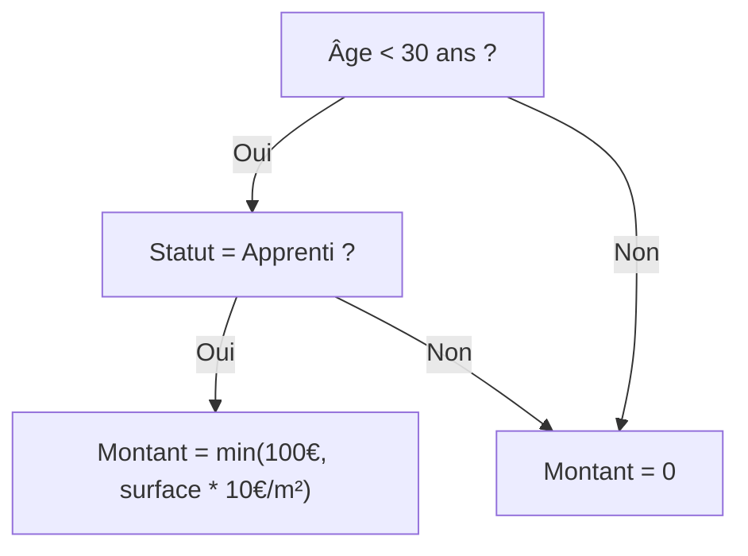
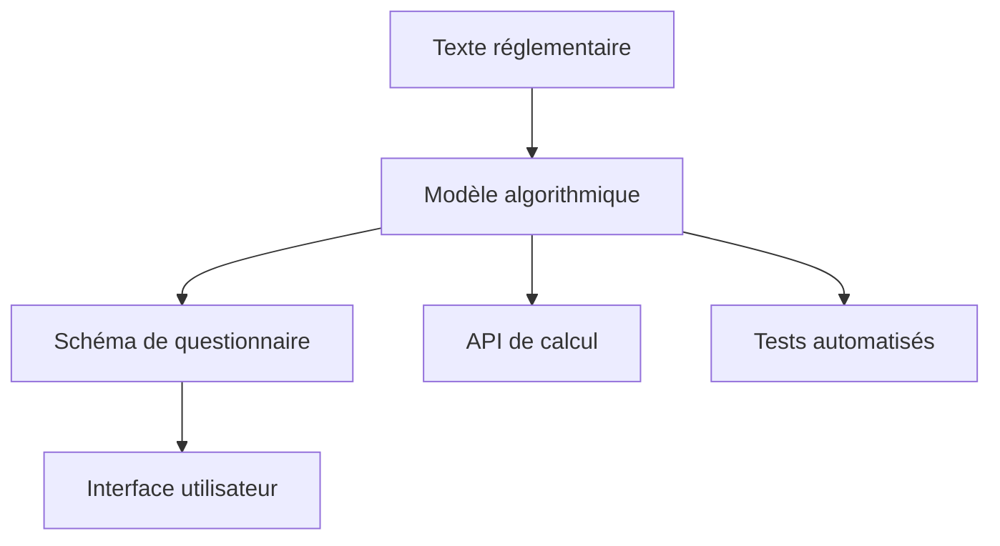

# Passer le modèle de règle en code

Une fois le modèle conceptuel défini, il faut l'implémenter techniquement, en code exécutable.

Ce passage du modèle au code repose sur trois étapes :

1. **Sélectionner un moteur de règles** (Publicodes, OpenFisca, ou autre) ;  
2. **Adapter la syntaxe** et la structure aux conventions du moteur ;  
3. **Implémenter et tester chaque condition**.

Le code doit **préserver la logique métier** et **référencer ses sources**.  
Chaque ligne doit pouvoir être reliée à un article de loi, un barème ou une hypothèse documentée.

## Glossaire des concepts clés

**Modéliser un dispositif** : Traduire un texte réglementaire écrit en langage naturel/juridique en langage formel (logique mathématique, organigramme, algorithme...)

**Un dispositif** : Une ou plusieurs règles qui ensemble visent à régir une situation particulière ou produire un effet juridique précis. *Exemple : aide personnalisée au logement*

**Une règle** : Une portion d'un texte réglementaire (une ou plusieurs *mesures*) que l'on peut identifier comme étant une instruction émise par les législateurs. *Exemple : règle d'éligibilité d'une personne à l'APL en cas de location en foyer*

## Deux formalismes complémentaires

Pour mettre en production un simulateur fonctionnel et adapté à son public, il faut souvent deux formalismes de modélisation complémentaires :

### a. La modélisation algorithmique

Elle formalise la règle sous une forme exécutable, indépendamment du public cible, en respectant :
- la logique du texte (conditions, seuils, barèmes) ;
- la structure du modèle (variables, entrées/sorties) ;
- les liens de dépendance entre aides.

### b. La modélisation du parcours utilisateur
Elle adapte la règle à une expérience de simulation fluide :
- simplification du langage ;
- regroupement des questions similaires ;
- affichage contextuel des résultats.

> Ces deux logiques doivent être **conçues ensemble** pour éviter les incohérences entre le code et l’interface.

## 3. Choisir un moteur de règles

Le moteur détermine la manière dont le modèle est traduit en code. Deux moteurs open source sont aujourd’hui les plus utilisés :

| Caractéristique | **OpenFisca** | **Publicodes** |
|------------------|---------------|----------------|
| Langage | Python | YAML-like |
| Finalité | Calculs socio-fiscaux complexes | Simulations lisibles, orientées utilisateurs |
| Structure | Variables hiérarchisées, modules | Règles déclaratives, formules explicites |
| Tests intégrés | Oui (Pytest, YAML tests) | Oui (playgrounds, fichiers tests) |
| Lisibilité non-technique | Moyenne | Excellente |
| Maintenance | Communauté active | Légère mais dynamique |
| Cas d’usage typique | Barèmes fiscaux, prestations sociales | Simulateurs d’aides simples, pédagogiques |

> Le choix du moteur dépend du niveau de complexité du dispositif, de la durée de vie du simulateur et du public cible.

## Exemple pratique : Mobili-jeunes

Prenons l'exemple de l'aide Mobili-jeunes et voyons comment elle se décline selon les moteurs.

### Règle simplifiée
> "Aide de 100€/mois max pour les apprentis de moins de 30 ans, plafonnée à 10€/m² de loyer"

### Modèle conceptuel



### Implémentation OpenFisca

```python
class mobili_jeunes_eligibilite(Variable):
    value_type = bool
    entity = Individu
    definition_period = MONTH
    
    def formula(individu, period):
        age = individu('age', period)
        apprenti = individu('apprenti', period)
        return (age < 30) * apprenti

class mobili_jeunes_montant(Variable):
    value_type = float
    entity = Menage
    definition_period = MONTH
    
    def formula(menage, period):
        eligible = menage.sum(menage.members('mobili_jeunes_eligibilite', period))
        loyer = menage('loyer', period)
        surface = menage('surface_logement', period)
        
        montant_base = 100
        plafond_loyer = surface * 10
        
        return eligible * min(montant_base, plafond_loyer)
```

### Implémentation Publicodes

```yaml
mobili-jeunes . éligibilité:
  formule:
    toutes ces conditions:
      - âge < 30
      - apprenti = oui

mobili-jeunes . montant:
  formule:
    le minimum de:
      - 100 €/mois
      - surface logement * 10 €/m²
  applicable si: mobili-jeunes . éligibilité
```

## Du modèle au schéma de questionnaire

Une fois le modèle exécuté, il faut le rendre interactif. Un simulateur repose alors sur un schéma de questions lié aux variables du modèle. Deux cas de figure se présentent :

### Cas 1 : le modèle suffit

// merged :
Le modèle algorithmique peut directement générer les questions si :
- le parcours est relativement court ;
- l'ordre de saisie importe peu ;
- les variables sont explicites et simples ;
- il n'y a pas d'optimisation UX spécifiques nécessaires.

### Cas 2 : passer par un schéma intermédiaire

Il faut créer un schéma spécifique de description du formulaire lorsque :
- on ne souhaite pas que le simulateur entre dans tous les détails du modèle ;
- certaines variables nécessitent des regroupements ou des inférences (ex. “travail à l’étranger”) ;
- le parcours doit être optimisé pour l'utilisateur (ex. questions conditionnelles, ordonnancement spécifique) ;
- le public cible nécessite des adaptations du langage ou des concepts.
- on souhaite ordonner les questions de manière spécifique (ex. regrouper les questions sur le logement) ;

Voici un exemple de schéma JSON reprenant l'aide plus haut :

```json
{
  "id": "eligibilite_mobili_jeune",
  "questions": [
    {
      "clé": "âge",
      "texte": "Quel est votre âge ?",
      "type": "number",
      "obligatoire": true
    },
    {
      "clé": "type_contrat",
      "texte": "Quel est votre type de contrat ?",
      "type": "choice",
      "options": ["CDI", "CDD", "Alternance"]
    }
  ]
}
```

Un tel schéma relie certaines question à une variable du modèle et permet d’automatiser la création de formulaires.

::: tip Conseil pratique
Commencez toujours par la modélisation algorithmique pure avant d'optimiser l'expérience utilisateur. Cela garantit la cohérence réglementaire.
:::

## [À venir] : Du schéma au front-end

## Bonnes pratiques

### Vérifier le comportement du code

Les moteurs de règles incluent des frameworks de test intégrés.
Chaque modèle doit être accompagné d’un dossier /tests contenant des cas d’entrée et les résultats attendus.

Exemple de test YAML

```yaml
- nom: "Cas étudiant éligible"
  input:
    age: 22
    statut: "salarié"
    type_contrat: "alternance"
    distance_domicile_travail: 15
  output:
    eligible: true
```

Les tests servent à :
- détecter les régressions lors des mises à jour ;
- vérifier la cohérence entre les modèles d’aides ;
- renforcer la confiance des utilisateurs et des partenaires.

[Plus d'infos sur les tests](/01_simulateurs/05_tester-ajuster)

### Gérer les dépendances et les temporalités

Chaque aide peut dépendre :
	•	de valeurs passées (revenus de l’année précédente) ;
	•	d’aides connexes (APL, RSA, bourses) ;
	•	de paramètres révisés annuellement.

Recommandations :
	•	documenter les périodes de validité (du / au) dans les fichiers YAML ou Python ;
	•	prévoir une mise à jour automatique via scripts ou pipelines CI/CD ;
	•	implémenter des tests temporels pour vérifier la cohérence des calculs selon les années.

### Séparation des responsabilités



### Publication et traçabilité

Une fois validé, le code doit être :
- publié en open source (sauf cas de confidentialité) ;
- versionné (v2025.1) avec changelog clair ;
- documenté (sources, hypothèses, règles de calcul).

Chaque commit doit inclure :
- le texte juridique de référence ;
- la nature du changement ;
- l’impact sur les résultats.

## Prochaines étapes

Une fois votre modèle implémenté en code :
- [Tester et ajuster votre simulateur](/01_simulateurs/05_tester-ajuster) - Valider la conformité et l'UX
- [Maintenir dans le temps](/01_simulateurs/06_maintenir) - Garantir la pérennité
