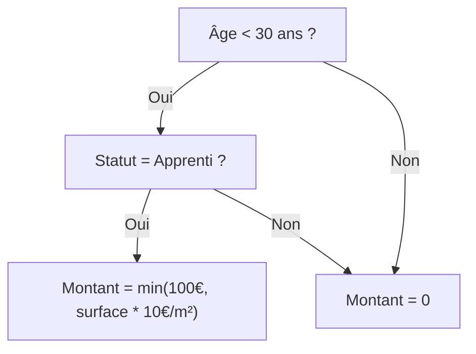
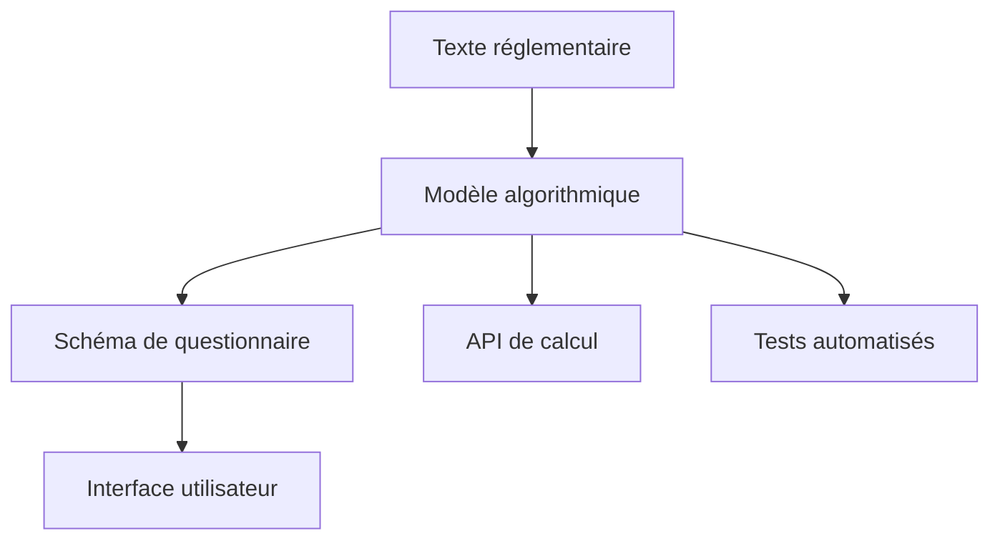

# Passer le modèle de règle en code

Une fois le modèle conceptuel défini, il faut l'implémenter techniquement, en code exécutable.

Ce passage du modèle au code repose sur trois étapes :

1. **Sélectionner un moteur de règles** (Publicodes, OpenFisca, ou autre) ;  
2. **Adapter la syntaxe** et la structure aux conventions du moteur ;  
3. **Implémenter et tester chaque condition**.

Le code doit **préserver la logique métier** et **référencer ses sources**.  
Chaque ligne doit pouvoir être reliée à un article de loi, un barème ou une hypothèse documentée.

## Glossaire des concepts clés

**Modéliser un dispositif** : Traduire un texte réglementaire écrit en langage naturel/juridique en langage formel (logique mathématique, organigramme, algorithme...)

**Un dispositif** : Une ou plusieurs règles qui ensemble visent à régir une situation particulière ou produire un effet juridique précis. *Exemple : aide personnalisée au logement*

**Une règle** : Une portion d'un texte réglementaire (une ou plusieurs *mesures*) que l'on peut identifier comme étant une instruction émise par les législateurs. *Exemple : règle d'éligibilité d'une personne à l'APL en cas de location en foyer*

## Deux formalismes complémentaires

Pour mettre en production un simulateur fonctionnel et adapté à son public, il faut souvent deux formalismes de modélisation complémentaires :

### a. La modélisation algorithmique

Elle formalise la règle sous une forme exécutable, indépendamment du public cible, en respectant :
- la logique du texte (conditions, seuils, barèmes) ;
- la structure du modèle (variables, entrées/sorties) ;
- les liens de dépendance entre aides.

### b. La modélisation du parcours utilisateur
Elle adapte la règle à une expérience de simulation fluide :
- simplification du langage ;
- regroupement des questions similaires ;
- affichage contextuel des résultats.

> Ces deux logiques doivent être **conçues ensemble** pour éviter les incohérences entre le code et l’interface.

## 3. Choisir un moteur de règles

Le moteur détermine la manière dont le modèle est traduit en code. Deux moteurs open source sont aujourd’hui les plus utilisés :

| Caractéristique | **OpenFisca** | **Publicodes** |
|------------------|---------------|----------------|
| Langage | Python | YAML-like |
| Finalité | Calculs socio-fiscaux complexes | Simulations lisibles, orientées utilisateurs |
| Structure | Variables hiérarchisées, modules | Règles déclaratives, formules explicites |
| Tests intégrés | Oui (Pytest, YAML tests) | Oui (playgrounds, fichiers tests) |
| Lisibilité non-technique | Moyenne | Excellente |
| Maintenance | Communauté active | Légère mais dynamique |
| Cas d’usage typique | Barèmes fiscaux, prestations sociales | Simulateurs d’aides simples, pédagogiques |

> Le choix du moteur dépend du niveau de complexité du dispositif, de la durée de vie du simulateur et du public cible.

## Exemple pratique : Mobili-jeunes

Prenons l'exemple de l'aide Mobili-jeunes et voyons comment elle se décline selon les moteurs.

### Règle simplifiée
> "Aide de 100€/mois max pour les apprentis de moins de 30 ans, plafonnée à 10€/m² de loyer"

### Modèle conceptuel


```mermaid
graph TD
    A["Âge < 30 ans ?"] -->|"Oui"| B["Statut = Apprenti ?"]
    B -->|"Oui"| C["Montant = min(100€, surface * 10€/m²)"]
    B -->|"Non"| D["Montant = 0"]
    A -->|"Non"| D
```

### Implémentation OpenFisca

```python
class mobili_jeunes_eligibilite(Variable):
    value_type = bool
    entity = Individu
    definition_period = MONTH
    
    def formula(individu, period):
        age = individu('age', period)
        apprenti = individu('apprenti', period)
        return (age < 30) * apprenti

class mobili_jeunes_montant(Variable):
    value_type = float
    entity = Menage
    definition_period = MONTH
    
    def formula(menage, period):
        eligible = menage.sum(menage.members('mobili_jeunes_eligibilite', period))
        loyer = menage('loyer', period)
        surface = menage('surface_logement', period)
        
        montant_base = 100
        plafond_loyer = surface * 10
        
        return eligible * min(montant_base, plafond_loyer)
```

### Implémentation Publicodes

```yaml
mobili-jeunes . éligibilité:
  formule:
    toutes ces conditions:
      - âge < 30
      - apprenti = oui

mobili-jeunes . montant:
  formule:
    le minimum de:
      - 100 €/mois
      - surface logement * 10 €/m²
    applicable si: mobili-jeunes . éligibilité
```

## Du modèle au schéma de questionnaire

Une fois le modèle exécuté, il faut le rendre interactif. Les projets de l'écosystème ont développé plusieurs architectures pour connecter formulaires et moteurs de calcul. Le choix dépend du contexte : type de moteur, besoins UX, composition de l'équipe.

### Pattern 1 : Schéma déclaratif multi-moteur

Le formulaire est décrit dans un fichier JSON/YAML indépendant. Il peut alimenter plusieurs moteurs (Publicodes, OpenFisca, custom).

**Exemple** : aides-simplifiees (survey-schema)

**Caractéristiques** :
- Découplage total UI / moteur
- Multi-moteur natif
- Réutilisable entre frameworks (React, Vue, etc.)
- Nécessite un système de synchronisation

### Pattern 2 : Formulaire généré depuis les règles

L'UI est dérivée automatiquement des métadonnées du moteur. Chaque variable d'entrée devient une question.

**Exemples** : mon-entreprise (RuleInput), publicodes-core (@publicodes/forms)

**Caractéristiques** :
- Source unique (les règles)
- Cohérence garantie
- Personnalisation via extension des règles
- Couplé au moteur Publicodes

### Pattern 3 : Config YAML + moteur séparé

Les questions ou programmes sont décrits en YAML. Le moteur est invoqué séparément avec les réponses.

**Exemples** : mes-aides-reno, transition-widget (213 programmes), nosgestesclimat

**Caractéristiques** :
- Flexibilité d'ordonnancement
- Séparation claire données / calcul
- Adapté aux catalogues de programmes/aides

### Pattern 4 : Formulaires dynamiques codés

Les questions sont définies en TypeScript/JavaScript avec la logique de transformation intégrée.

**Exemples** : aides-jeunes (Property classes), code-du-travail, a-just

**Caractéristiques** :
- Grande flexibilité
- Couplage fort au code
- Contribution nécessite compétences dev
- Adapté aux parcours complexes

### Pattern 5 : API backend + formulaire découplé

Le formulaire frontend est indépendant. Il appelle une API qui interroge le moteur (OpenFisca, custom).

**Exemples** : estime, leximpact, mes-ressources-formation

**Caractéristiques** :
- Séparation nette frontend/backend
- Adapté aux architectures distribuées
- Le moteur peut être dans un autre langage

### Approches sans moteur déclaratif

Certains projets utilisent des approches spécifiques :
- envergo : Moulinette Python custom
- pacoupa : Lookup SQLite + validation Zod
- impact-co2 : Données JSON + state React

### Aide au choix

| Besoin | Pattern adapté |
|--------|----------------|
| Multi-moteur (Publicodes + OpenFisca) | Schéma déclaratif |
| Cohérence automatique règles/UI | Formulaire généré |
| Catalogue de programmes/aides | Config déclarative |
| Parcours très personnalisé | Formulaires codés |
| Architecture microservices | Backend découplé |
| Équipe sans designer | Formulaire généré |
| Contribution non-dev souhaitée | Config déclarative |

### Exemple de schéma JSON

Voici un exemple de schéma déclaratif pour l'aide Mobili-jeunes :

```json
{
  "id": "eligibilite_mobili_jeune",
  "engine": "openfisca",
  "questions": [
    {
      "clé": "âge",
      "texte": "Quel est votre âge ?",
      "type": "number",
      "obligatoire": true
    },
    {
      "clé": "type_contrat",
      "texte": "Quel est votre type de contrat ?",
      "type": "choice",
      "options": ["CDI", "CDD", "Alternance"]
    }
  ]
}
```

Un tel schéma relie certaines questions à une variable du modèle et permet d'automatiser la création de formulaires.

::: tip Conseil pratique
Commencez toujours par la modélisation algorithmique pure avant d'optimiser l'expérience utilisateur. Cela garantit la cohérence réglementaire.
:::

::: info Pour aller plus loin
Voir [Patterns architecturaux](/02_ecosysteme/03_patterns) pour une analyse détaillée des différentes approches avec schémas et matrices de décision.
:::

## [À venir] : Du schéma au front-end

## Bonnes pratiques

    age: 22
    statut: "salarié"
    type_contrat: "alternance"
    distance_domicile_travail: 15
  output:
    eligible: true
```

Les tests servent à :
- détecter les régressions lors des mises à jour ;
- vérifier la cohérence entre les modèles d’aides ;
- renforcer la confiance des utilisateurs et des partenaires.

[Plus d'infos sur les tests](/01_simulateurs/05_tester-ajuster)

### Gérer les dépendances et les temporalités

Chaque aide peut dépendre :
	•	de valeurs passées (revenus de l’année précédente) ;
	•	d’aides connexes (APL, RSA, bourses) ;
	•	de paramètres révisés annuellement.

Recommandations :
	•	documenter les périodes de validité (du / au) dans les fichiers YAML ou Python ;
	•	prévoir une mise à jour automatique via scripts ou pipelines CI/CD ;
	•	implémenter des tests temporels pour vérifier la cohérence des calculs selon les années.

### Séparation des responsabilités


```mermaid
graph TD
    A[Texte réglementaire] --> B[Modèle algorithmique]
    B --> C[Schéma de questionnaire]
    C --> D[Interface utilisateur]
    B --> E[API de calcul]
    B --> F[Tests automatisés]
```

### Publication et traçabilité

Une fois validé, le code doit être :
- publié en open source (sauf cas de confidentialité) ;
- versionné (v2025.1) avec changelog clair ;
- documenté (sources, hypothèses, règles de calcul).

Chaque commit doit inclure :
- le texte juridique de référence ;
- la nature du changement ;
- l’impact sur les résultats.

## Prochaines étapes

Une fois votre modèle implémenté en code :
- [Tester et ajuster votre simulateur](/01_simulateurs/05_tester-ajuster) - Valider la conformité et l'UX
- [Maintenir dans le temps](/01_simulateurs/06_maintenir) - Garantir la pérennité
