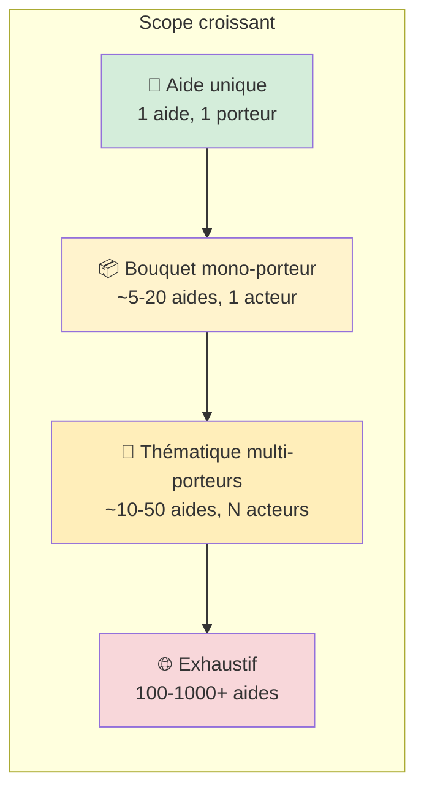
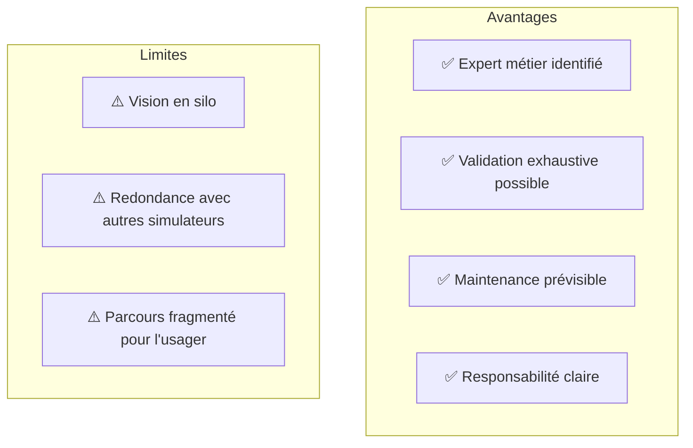
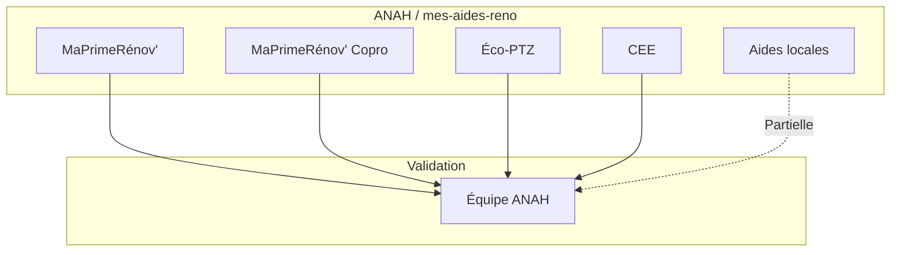
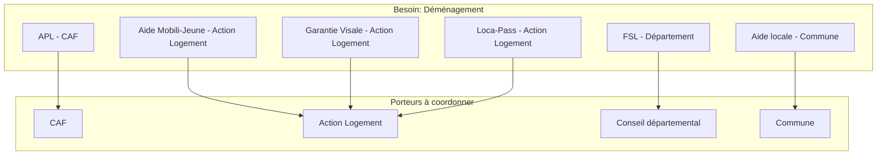
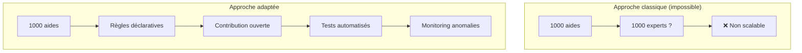
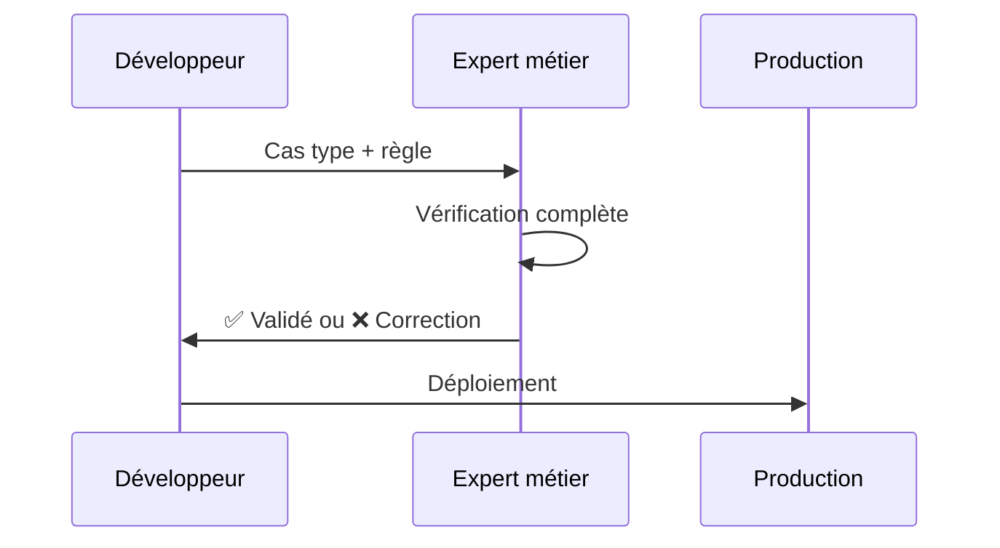
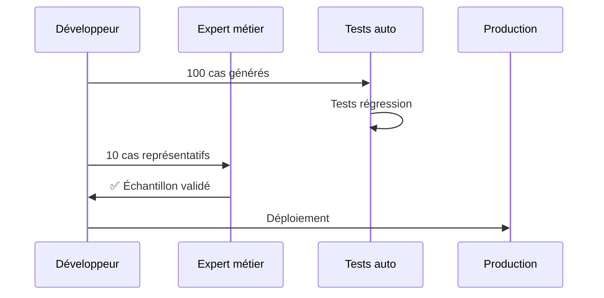
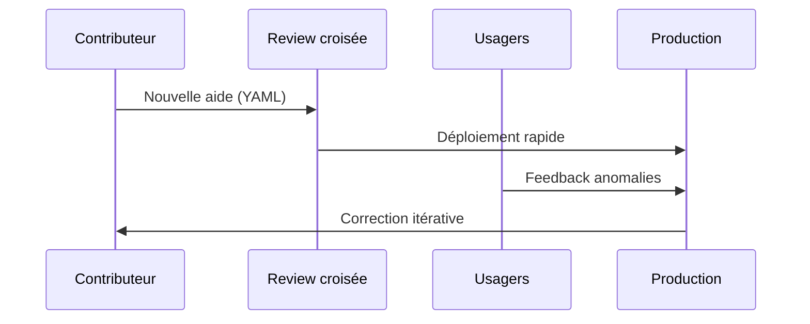

# Le scope des aides : un enjeu stratégique

Le **périmètre des aides** couvertes par un simulateur est un choix structurant qui détermine l'architecture technique, la gouvernance, la stratégie de validation et la soutenabilité du projet.

Ce choix est rarement explicité, alors qu'il conditionne tout le reste.

## Le spectre des périmètres



::: info Exemples dans l'écosystème
Voir le [Panorama des simulateurs](/02_ecosysteme/01_panorama) pour des exemples concrets à chaque niveau de scope.
:::

| Niveau | Exemples | Nb aides | Porteurs | Validation |
|--------|----------|----------|----------|------------|
| **Aide unique** | Simulateur APL CAF, Prime Rénov' | 1 | 1 | Expert dédié |
| **Bouquet mono-porteur** | mes-aides-reno (ANAH), aides-agri | 5-20 | 1 | Équipe interne |
| **Thématique multi-porteurs** | aides-simplifiées (déménagement), transition-widget | 10-50 | N | Réseau d'experts |
| **Exhaustif** | 1jeune1solution, MesAides historique | 100-1000+ | N++ | Impossible unitaire |

---

## Les tensions selon le scope

### Aide unique : la "zone de confort"



**Projets typiques** : Simulateurs institutionnels (CAF, CPAM, Pôle Emploi)

**Validation** : Un expert métier peut valider **100% des cas**.

---

### Bouquet mono-porteur : l'optimum local

Un seul acteur (ministère, agence, collectivité) porte plusieurs aides qu'il regroupe dans un simulateur cohérent.



**Avantages** :
- Cohérence garantie par le porteur unique
- Variables communes naturelles (logement, ménage)
- Expert métier accessible

**Limites** :
- Les aides locales (collectivités) échappent souvent au périmètre
- Dépendance à un acteur institutionnel

**Stratégie de validation** : L'équipe produit peut solliciter directement les experts du porteur.

---

### Thématique multi-porteurs : le défi de coordination

Plusieurs aides de porteurs différents sont regroupées autour d'un **besoin utilisateur** (déménager, se former, créer une entreprise).



**Le problème de la validation** :

| Aide | Porteur | Expert accessible ? | Délai réponse |
|------|---------|---------------------|---------------|
| APL | CAF | ✅ Oui (partenariat) | 1-2 semaines |
| Mobili-Jeune | Action Logement | ⚠️ Difficile | 1-2 mois |
| FSL | Département | ❌ Variable selon territoire | Variable |
| Aide locale | Commune | ❌ Très variable | Inconnu |

::: warning Problème clé
**Plus le scope s'élargit, moins la validation unitaire par un expert est réaliste.**
:::

**Stratégies d'adaptation** :

1. **Prioriser les aides "validables"** : Commencer par celles où un expert est accessible
2. **Accepter l'incertitude documentée** : Signaler les aides "non validées par un expert"
3. **Crowdsourcing de la validation** : Impliquer les usagers dans la détection d'erreurs
4. **Tests croisés** : Comparer avec d'autres simulateurs existants

---

### Exhaustif (100-1000+ aides) : le changement de paradigme

Au-delà de ~50 aides, le modèle de validation change fondamentalement.



**Projets typiques** :
- **1jeune1solution** : 1000+ aides, catalogue + éligibilité simplifiée
- **MesAides historique** : 25+ aides, calcul précis mais maintenance difficile
- **aides-jeunes** : ~50 aides, contribution no-code (NetlifyCMS)

**Ce qui change** :

| Aspect | Scope restreint | Scope exhaustif |
|--------|-----------------|-----------------|
| Validation | Expert par aide | Statistique / crowdsource |
| Précision | Calcul exact | Estimation / fourchette |
| Maintenance | Équipe dédiée | Communauté + automation |
| Confiance | "Résultat garanti" | "Estimation indicative" |
| Engagement | "Faites votre demande" | "Vérifiez auprès de l'organisme" |

---

## Les modèles de validation selon le scope

### Modèle 1 : Validation experte exhaustive



**Applicable pour** : 1-20 aides
**Confiance** : Haute
**Coût** : Élevé par aide

---

### Modèle 2 : Validation par échantillonnage



**Applicable pour** : 20-100 aides
**Confiance** : Moyenne-haute
**Coût** : Modéré

---

### Modèle 3 : Validation communautaire



**Applicable pour** : 100+ aides
**Confiance** : Variable (à expliciter)
**Coût** : Faible par aide, élevé en infrastructure

---

## Stratégies observées dans l'écosystème

### aides-jeunes : Contribution no-code + OpenFisca

```yaml
# Exemple de contribution YAML
prestations:
  aide_mobilite:
    label: "Aide à la mobilité"
    description: "..."
    conditions:
      - age < 26
      - demandeur_emploi
    montant: 1000
    lien: "https://..."
    institution: pole_emploi
```

**Points forts** :
- Contribution accessible (NetlifyCMS)
- Format déclaratif lisible
- ~50 aides maintenues

**Limites** :
- Validation informelle
- Références légales partielles

---

### transition-widget : Catalogue de 213 programmes

Le projet gère **213 programmes** d'aides à la transition écologique avec une approche différente :

```yaml
# Structure d'un programme
programmes:
  - titre: "Aide à la rénovation énergétique PME"
    publicodes:
      eligibilite:
        toutes ces conditions:
          - entreprise . effectif < 250
          - projet . type = 'renovation'
    lien_formulaire: "https://..."
```

**Stratégie** :
- Pas de calcul de montant (trop variable)
- Éligibilité binaire (oui/non)
- Redirection vers le formulaire officiel

---

### aides-simplifiees : Approche hybride

**Stratégie adoptée** :
1. **Périmètre thématique** : Déménagement, logement jeunes
2. **Multi-moteur** : Publicodes (simple) + OpenFisca (complexe)
3. **Validation tracée** : Metadata `validated_by` dans les cas types
4. **Niveaux de confiance** : Distinguer aides "validées" vs "indicatives"

```json
{
  "metadata": {
    "validated_by": "expert_caf",
    "validation_date": "2025-01-15",
    "confidence_level": "high"
  }
}
```

---

## Recommandations par scope

### Scope 1-5 aides : "Faire simple"

- ✅ Validation experte exhaustive
- ✅ Calcul précis des montants
- ✅ Engagement fort ("Vous êtes éligible à X€")
- ⚠️ Ne pas sur-architecturer

### Scope 5-20 aides : "Structurer"

- ✅ Variables communes formalisées
- ✅ Cas types par aide avec validation
- ✅ Tests de non-régression
- ⚠️ Identifier un référent par aide

### Scope 20-50 aides : "Prioriser"

- ✅ Distinguer aides "cœur" (validées) vs "périphériques"
- ✅ Accepter des niveaux de précision différents
- ✅ Contribution ouverte avec review
- ⚠️ Communiquer le niveau de confiance à l'usager

### Scope 50+ aides : "Assumer l'estimation"

- ✅ Catalogue + éligibilité simplifiée
- ✅ Redirection vers simulateurs officiels
- ✅ Monitoring des anomalies signalées
- ⚠️ Ne pas promettre de précision impossible
- ⚠️ Mention "Vérifiez auprès de l'organisme"

---

## La question de la communication à l'usager

Le scope impacte directement **ce qu'on peut promettre** à l'usager :

| Scope | Message approprié |
|-------|-------------------|
| Aide unique | "Vous êtes éligible. Montant estimé : 150€/mois" |
| Bouquet mono-porteur | "Selon vos réponses, vous pourriez bénéficier de 3 aides" |
| Thématique multi-porteurs | "Vous semblez éligible à ces aides. Vérifiez les conditions détaillées" |
| Exhaustif | "Voici les aides qui pourraient vous concerner. Contactez chaque organisme" |

::: tip Principe de transparence
**Plus le scope est large, plus il faut être explicite sur les limites du simulateur.**
:::

---

## Évolution du scope dans le temps

Un projet peut **évoluer** dans le spectre :

```mermaid
flowchart LR
    A[MVP<br/>3 aides validées] --> B[V1<br/>10 aides<br/>dont 3 "indicatives"]
    B --> C[V2<br/>25 aides<br/>contribution ouverte]
    C --> D[V3<br/>50+ aides<br/>catalogue + simulation]
```

**Attention** : L'élargissement du scope doit s'accompagner d'une **évolution de la communication** et des **processus de validation**.

---

## Checklist de décision

Avant de définir le scope d'un simulateur :

- [ ] Quel est le **besoin utilisateur** réel ? (pas le besoin institutionnel)
- [ ] Combien d'aides sont **réellement validables** par un expert ?
- [ ] Quel **niveau de précision** est attendu ? (calcul exact vs estimation)
- [ ] Quelle **capacité de maintenance** sur la durée ?
- [ ] Comment **communiquer les limites** à l'usager ?
- [ ] Existe-t-il des **simulateurs officiels** à ne pas dupliquer ?

---

## Voir aussi

- [Simulateur multi-aide](/01_simulateurs/03_simulateur-multi-aide) - Aspects techniques
- [Collaboration métier-produit](/02_ecosysteme/04_collaboration) - Relation avec les experts
- [Tester et ajuster](/01_simulateurs/06_tester-ajuster) - Formats de cas types
- [Panorama des projets](/02_ecosysteme/01_panorama) - Exemples concrets par scope
