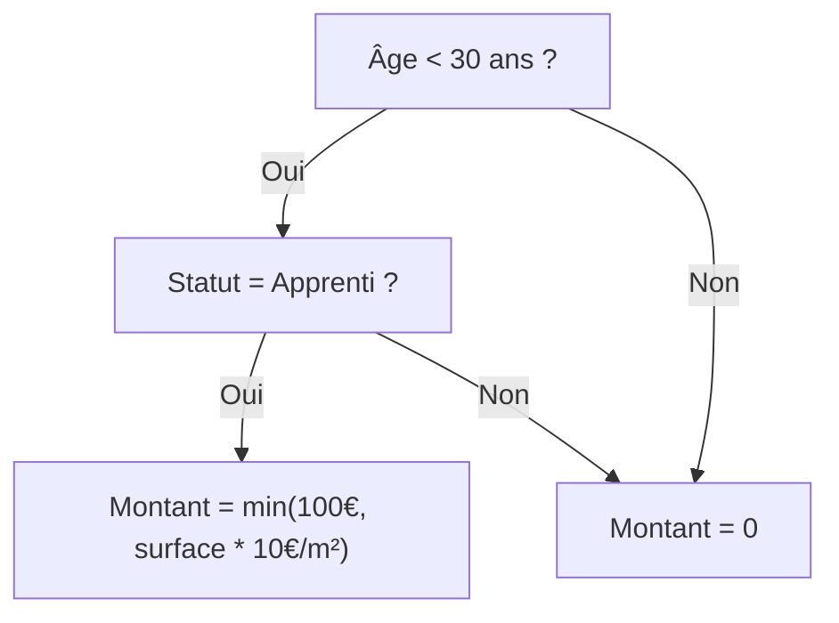
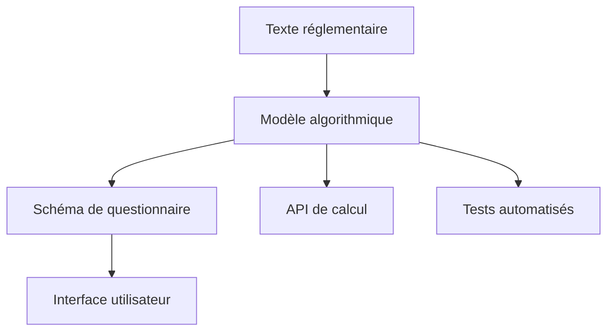

# Passer le modèle de règle en code

Une fois le modèle conceptuel défini, il faut l'implémenter techniquement, en code exécutable.

Ce passage du modèle au code repose sur trois étapes :

1. **Sélectionner un moteur de règles** (Publicodes, OpenFisca, ou autre) ;  
2. **Adapter la syntaxe** et la structure aux conventions du moteur ;  
3. **Implémenter et tester chaque condition**.

Le code doit **préserver la logique métier** et **référencer ses sources**.  
Chaque ligne doit pouvoir être reliée à un article de loi, un barème ou une hypothèse documentée.

## Glossaire des concepts clés

**Modéliser un dispositif** : Traduire un texte réglementaire écrit en langage naturel/juridique en langage formel (logique mathématique, organigramme, algorithme...)

**Un dispositif** : Une ou plusieurs règles qui ensemble visent à régir une situation particulière ou produire un effet juridique précis. *Exemple : aide personnalisée au logement*

**Une règle** : Une portion d'un texte réglementaire (une ou plusieurs *mesures*) que l'on peut identifier comme étant une instruction émise par les législateurs. *Exemple : règle d'éligibilité d'une personne à l'APL en cas de location en foyer*

## Deux formalismes complémentaires

Pour mettre en production un simulateur fonctionnel et adapté à son public, il faut souvent deux formalismes de modélisation complémentaires :

### a. La modélisation algorithmique

Elle formalise la règle sous une forme exécutable, indépendamment du public cible, en respectant :
- la logique du texte (conditions, seuils, barèmes) ;
- la structure du modèle (variables, entrées/sorties) ;
- les liens de dépendance entre aides.

### b. La modélisation du parcours utilisateur
Elle adapte la règle à une expérience de simulation fluide :
- simplification du langage ;
- regroupement des questions similaires ;
- affichage contextuel des résultats.

> Ces deux logiques doivent être **conçues ensemble** pour éviter les incohérences entre le code et l’interface.

## 3. Choisir un moteur de règles

Le moteur détermine la manière dont le modèle est traduit en code. Deux moteurs open source sont aujourd’hui les plus utilisés :

| Caractéristique | **OpenFisca** | **Publicodes** |
|------------------|---------------|----------------|
| Langage | Python | YAML-like |
| Finalité | Calculs socio-fiscaux complexes | Simulations lisibles, orientées utilisateurs |
| Structure | Variables hiérarchisées, modules | Règles déclaratives, formules explicites |
| Tests intégrés | Oui (Pytest, YAML tests) | Oui (playgrounds, fichiers tests) |
| Lisibilité non-technique | Moyenne | Excellente |
| Maintenance | Communauté active | Légère mais dynamique |
| Cas d’usage typique | Barèmes fiscaux, prestations sociales | Simulateurs d’aides simples, pédagogiques |

> Le choix du moteur dépend du niveau de complexité du dispositif, de la durée de vie du simulateur et du public cible.

::: info Outils disponibles
Voir [Outils et briques réutilisables](/02_ecosysteme/02_outils) pour l'inventaire des packages NPM, des moteurs de règles et des composants de formulaire.
:::

## Exemple pratique : Mobili-jeunes

Prenons l'exemple de l'aide Mobili-jeunes et voyons comment elle se décline selon les moteurs.

### Règle simplifiée
> "Aide de 100€/mois max pour les apprentis de moins de 30 ans, plafonnée à 10€/m² de loyer"

### Modèle conceptuel



### Implémentation OpenFisca

```python
class mobili_jeunes_eligibilite(Variable):
    value_type = bool
    entity = Individu
    definition_period = MONTH
    
    def formula(individu, period):
        age = individu('age', period)
        apprenti = individu('apprenti', period)
        return (age < 30) * apprenti

class mobili_jeunes_montant(Variable):
    value_type = float
    entity = Menage
    definition_period = MONTH
    
    def formula(menage, period):
        eligible = menage.sum(menage.members('mobili_jeunes_eligibilite', period))
        loyer = menage('loyer', period)
        surface = menage('surface_logement', period)
        
        montant_base = 100
        plafond_loyer = surface * 10
        
        return eligible * min(montant_base, plafond_loyer)
```

### Implémentation Publicodes

```yaml
mobili-jeunes . éligibilité:
  formule:
    toutes ces conditions:
      - âge < 30
      - apprenti = oui

mobili-jeunes . montant:
  formule:
    le minimum de:
      - 100 €/mois
      - surface logement * 10 €/m²
    applicable si: mobili-jeunes . éligibilité
```

## Du modèle au schéma de questionnaire

Une fois le modèle exécuté, il faut le rendre interactif. L'architecture qui connecte le formulaire au moteur de calcul repose sur **trois axes orthogonaux** qui se combinent :

1. **Définition du formulaire** : Comment les questions sont-elles décrites ?
2. **Localisation du calcul** : Où le moteur de règles s'exécute-t-il ?
3. **Couche de mapping** : Quelle transformation entre les réponses utilisateur et le moteur ?

### Axe 1 : Définition du formulaire

#### Config déclarative (JSON/YAML)

Le formulaire est décrit dans un fichier de configuration séparé du code.

**Variantes** :
- **YAML comme filtre d'ordonnancement** ([mes-aides-reno](https://beta.gouv.fr/startups/mesaidesreno.html)) : le YAML référence des règles Publicodes, les questions sont définies dans le moteur
- **JSON comme schéma complet** (aides-simplifiees) : le JSON décrit intégralement le formulaire, indépendamment du moteur

#### Formulaire généré depuis les règles

L'UI est dérivée automatiquement des métadonnées Publicodes.

**Exemples** : [mon-entreprise](https://beta.gouv.fr/startups/mon-entreprise.html) (RuleInput), @publicodes/forms

#### Formulaires codés

Les questions sont définies en TypeScript/JavaScript.

**Exemples** : [aides-jeunes](https://beta.gouv.fr/startups/aides.jeunes.html) (Property classes), [a-just](https://beta.gouv.fr/startups/a-just.html) (Angular Forms)

### Axe 2 : Localisation du calcul

| Localisation | Projets | Avantages | Inconvénients |
|--------------|---------|-----------|---------------|
| **Client (navigateur)** | [mes-aides-reno](https://beta.gouv.fr/startups/mesaidesreno.html), [mon-entreprise](https://beta.gouv.fr/startups/mon-entreprise.html), [nosgestesclimat](https://github.com/incubateur-ademe/nosgestesclimat) | Pas de latence, réactivité | Publicodes uniquement |
| **Serveur (proxy)** | aides-simplifiees (OpenFisca) | Multi-moteur possible | Latence réseau |
| **Serveur (métier)** | [estime](https://beta.gouv.fr/startups/estime.html) (Java), [mes-ressources-formation](https://beta.gouv.fr/startups/estime.formation.html) | Logique backend complexe | Traçabilité difficile |

### Axe 3 : Couche de mapping

::: warning Point d'attention
La couche de mapping est souvent **source de difficultés de traçabilité** entre les questions posées à l'utilisateur et les variables calculées par le moteur.
:::

| Type | Description | Traçabilité |
|------|-------------|-------------|
| **Aucune** | Publicodes direct | Excellente |
| **Formatters légers** | Transformation simple des valeurs | Bonne |
| **Builder complexe** | Dispatchers, entity managers, périodes (aides-simplifiees → OpenFisca) | Moyenne |
| **Mappeurs multiples** | 16 classes Java (estime) | Difficile |

### Combinaisons observées

| Projet | Définition | Calcul | Mapping |
|--------|------------|--------|---------|------------|
| **aides-simplifiees** | JSON multi-moteur | Client + Proxy | Builder TypeScript |
| **[mes-aides-reno](https://beta.gouv.fr/startups/mesaidesreno.html)** | YAML priorités | Client | Direct |
| **[mon-entreprise](https://beta.gouv.fr/startups/mon-entreprise.html)** | Généré depuis règles | Client | Direct |
| **[aides-jeunes](https://beta.gouv.fr/startups/aides.jeunes.html)** | Codé (Property classes) | Serveur | Intégré au code |
| **[estime](https://beta.gouv.fr/startups/estime.html)** | Codé (Angular Forms) | Serveur métier | 16 mappeurs Java |

### Aide au choix

| Besoin | Définition | Calcul | Mapping |
|--------|------------|--------|---------|------------|
| Multi-moteur (Publicodes + OpenFisca) | Config JSON | Client + Serveur | Builder |
| Cohérence automatique règles/UI | Généré | Client | Direct |
| Contribution non-dev | Config YAML/JSON | Client | Direct |
| Parcours très personnalisé | Codé | Variable | Variable |
| Traçabilité maximale | Généré ou Config | Client | Direct |

### Exemple de schéma JSON

Voici un exemple de schéma déclaratif pour l'aide Mobili-jeunes :

```json
{
  "id": "eligibilite_mobili_jeune",
  "engine": "openfisca",
  "questions": [
    {
      "clé": "âge",
      "texte": "Quel est votre âge ?",
      "type": "number",
      "obligatoire": true
    },
    {
      "clé": "type_contrat",
      "texte": "Quel est votre type de contrat ?",
      "type": "choice",
      "options": ["CDI", "CDD", "Alternance"]
    }
  ]
}
```

Un tel schéma relie certaines questions à une variable du modèle et permet d'automatiser la création de formulaires.

> Conseil pratique : Commencez toujours par la modélisation algorithmique pure avant d'optimiser l'expérience utilisateur. Cela garantit la cohérence réglementaire.

::: info Pour aller plus loin
Voir [Patterns architecturaux](/02_ecosysteme/03_patterns) pour une analyse détaillée des différentes approches avec schémas et matrices de décision.
:::

## [À venir] : Du schéma au front-end

## Bonnes pratiques

    age: 22
    statut: "salarié"
    type_contrat: "alternance"
    distance_domicile_travail: 15
  output:
    eligible: true
```

Les tests servent à :
- détecter les régressions lors des mises à jour ;
- vérifier la cohérence entre les modèles d’aides ;
- renforcer la confiance des utilisateurs et des partenaires.

[Plus d'infos sur les tests](/01_simulateurs/06_tester-ajuster)

### Gérer les dépendances et les temporalités

Chaque aide peut dépendre :
- de valeurs passées (revenus de l’année précédente) ;
- d’aides connexes (APL, RSA, bourses) ;
- de paramètres révisés annuellement.

Recommandations :
- documenter les périodes de validité (du / au) dans les fichiers YAML ou Python ;
- prévoir une mise à jour automatique via scripts ou pipelines CI/CD ;
- implémenter des tests temporels pour vérifier la cohérence des calculs selon les années.

### Séparation des responsabilités



### Publication et traçabilité

Une fois validé, le code doit être :
- publié en open source (sauf cas de confidentialité) ;
- versionné (v2025.1) avec changelog clair ;
- documenté (sources, hypothèses, règles de calcul).

Chaque commit doit inclure :
- le texte juridique de référence ;
- la nature du changement ;
- l’impact sur les résultats.

## Prochaines étapes

Pour des cas plus avancés de simulateurs multiples ou complexes :
- [Simulateur multi-aide](/01_simulateurs/03_simulateur-multi-aide) - Combiner plusieurs aides dans un même simulateur

Une fois votre modèle implémenté en code :
- [Tester et ajuster votre simulateur](/01_simulateurs/06_tester-ajuster) - Valider la conformité et l'UX
- [Maintenir dans le temps](/01_simulateurs/07_maintenir) - Garantir la pérennité
