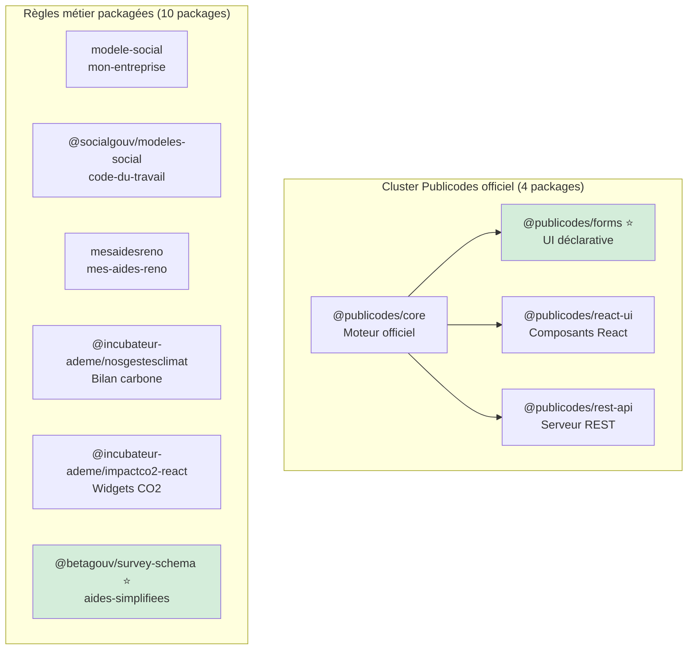

````markdown
# Outils et briques réutilisables

L'écosystème des simulateurs publics a produit de nombreux outils open source réutilisables. Cette page recense les principales briques disponibles.

::: info Packages NPM de l'écosystème
Plusieurs packages NPM sont publiés et réutilisables, répartis entre le cluster Publicodes officiel et les règles métier packagées.
:::

## Vue d'ensemble des packages NPM



## Moteurs de règles

### Publicodes

**Dépôt** : [github.com/publicodes/publicodes](https://github.com/publicodes/publicodes)

Moteur de règles déclaratif en YAML, optimisé pour la lisibilité et la contribution collaborative.

```yaml
# Exemple de règle Publicodes
aide . montant:
  formule:
    somme:
      - base
      - bonus si: conditions . prioritaire
```

**Packages NPM du cluster officiel** :

| Package | Version | Description |
|---------|---------|-------------|
| `@publicodes/core` | 1.9.1 | Moteur d'évaluation des règles |
| `@publicodes/forms` ⭐ | 1.9.1 | **Génération automatique de formulaires** |
| `@publicodes/react-ui` | 1.9.1 | Composants React (documentation, explications) |
| `@publicodes/rest-api` | 1.9.1 | Serveur REST auto-généré |

**Points forts** :
- Syntaxe accessible aux non-développeurs
- Documentation intégrée aux règles
- Écosystème JavaScript riche
- **@publicodes/forms résout le problème de liaison formulaire↔moteur**

**Limitations** :
- Moins adapté aux modèles multi-entités complexes
- Écosystème npm (nécessite compétences JS)

### OpenFisca

**Dépôt** : [github.com/openfisca](https://github.com/openfisca)

Moteur de microsimulation économique, référence pour les systèmes socio-fiscaux.

```python
# Exemple de variable OpenFisca
class aide_montant(Variable):
    value_type = float
    entity = Individu
    definition_period = MONTH
    
    def formula(individu, period):
        return individu('revenu', period) * 0.1
```

**Points forts** :
- Modélisation fine des entités (individu, foyer, ménage)
- Validation économique et juridique solide
- API REST native

**Limitations** :
- Courbe d'apprentissage plus longue
- Stack Python côté serveur

## Règles métier packagées (10 packages)

L'audit a identifié 10 packages NPM contenant des règles métier réutilisables :

| Package | Source | Domaine | Version |
|---------|--------|---------|---------|
| `modele-social` | mon-entreprise | Cotisations, statuts, fiscalité | 9.0.0 |
| `@socialgouv/modeles-social` | code-du-travail | 47 conventions collectives | 4.202.0 |
| `mesaidesreno` | mes-aides-reno | Rénovation énergétique | 1.6.1 |
| `@incubateur-ademe/nosgestesclimat` | nosgestesclimat | Bilan carbone, 5 langues | 1.9.1 |
| `@incubateur-ademe/impactco2-react` | impact-co2 | Widgets CO2 embeddables | - |
| `@incubateur-ademe/publicodes-acv-numerique` | impact-co2 | ACV numérique | 1.4.0 |
| `@betagouv/aides-velo` | aides-jeunes | Aides à l'achat vélo | - |
| `@betagouv/survey-schema` ⭐ | aides-simplifiees | Formulaires multi-moteur | 2.0.0 |
| `@shallowred/publicodes-entreprise-innovation` | aides-simplifiees | CIR/CII/JEI | - |
| `@leximpact/socio-fiscal-openfisca-json` | leximpact | Variables fiscales OpenFisca | - |

## Génération de formulaires

### @publicodes/forms ⭐ STRATÉGIQUE

**Dépôt** : [github.com/publicodes/publicodes](https://github.com/publicodes/publicodes) (packages/forms)

Génère automatiquement des formulaires React à partir de règles Publicodes. Identifié comme **asset stratégique** pour le cluster Publicodes.

**Caractéristiques** :
- Questions dérivées des métadonnées des règles
- Gestion des conditions d'affichage (`applicable si`)
- Personnalisation via composants React
- **Résout le problème de liaison formulaire↔moteur pour Publicodes**

**Projets utilisant ce pattern** : mon-entreprise (RuleInput), publicodes-core

### RuleInput (mon-entreprise)

Pattern développé par mon-entreprise pour générer des inputs typés depuis les règles Publicodes.

**Caractéristiques** :
- Composants React spécialisés par type de donnée
- Intégration design system
- Extensible

## Schémas déclaratifs

### @betagouv/survey-schema ⭐ STRATÉGIQUE

**Source** : aides-simplifiees  
**Version** : 2.0.0

Format JSON/YAML pour décrire des questionnaires **indépendamment du moteur de calcul**. Identifié comme **asset stratégique** pour l'interopérabilité Publicodes/OpenFisca.

```json
{
  "id": "demenagement-logement",
  "engine": "openfisca",
  "steps": [
    {
      "questions": [
        {
          "id": "date-naissance",
          "type": "date",
          "label": "Quelle est votre date de naissance ?",
          "required": true
        }
      ]
    }
  ]
}
```

**Caractéristiques** :
- Découplage formulaire / moteur
- **Multi-moteur natif** (Publicodes OU OpenFisca via champ `engine`)
- Génération UI agnostique au framework
- Validation JSON Schema

::: tip Recommandation
Ce format est le seul à permettre le dual-engine (Publicodes + OpenFisca) dans le même projet. Recommandé pour les nouveaux projets multi-aides.
:::

## Tests et validation

### Formats de cas types dans l'écosystème

L'audit a identifié deux formats matures pour partager des cas types métier :

#### Format shared-test-cases (aides-simplifiees) ⭐ STRATÉGIQUE

Format JSON traçant le flux complet formulaire → moteur → résultat avec **validation experte tracée**.

```json
{
  "name": "Alternant éligible APL",
  "metadata": {
    "validated_by": "expert_caf",
    "validated_at": "2025-01-15",
    "source_reference": "Dossier 2024-1234"
  },
  "survey_answers": { "age": 22, "contrat": "alternance" },
  "openfisca_request": { 
    "individus": { "demandeur": { "age": { "2025-01": 22 } } } 
  },
  "openfisca_response": { "apl": { "2025-01": 150 } }
}
```

**Points forts** :
- Traçabilité complète du flux (formulaire → moteur → résultat)
- **Validation experte avec metadata** (`validated_by`, `validated_at`)
- Réutilisable entre projets OpenFisca
- **Seul format avec validation métier tracée** (1/20 projets)

#### Format LexImpact (~100 cas types)

Format JSON avec expressions calculées et périodes.

```json
{
  "id": "007_aah",
  "description": "Personne en situation de handicap avec AAH",
  "dixieme": 2,
  "individus": {
    "Adulte 1": {
      "taux_incapacite": { "year": 0.8 },
      "salaire_de_base": { "year": "Math.round(smic * 0.5)" }
    }
  }
}
```

**Points forts** : 84 cas couvrant les 10 déciles de revenus INSEE, expressions calculées.

### Cas types YAML (Publicodes)

Format émergent pour formaliser des fixtures métier lisibles par les experts.

```yaml
cas_types:
  - nom: "Situation type éligible"
    entrees:
      age: 25
      revenu: 1200
    sorties_attendues:
      eligible: true
      montant: 150
```

**Avantages** :
- Lisible par les experts métier
- Exécutable comme tests automatisés
- Traçable vers des situations réelles

**Projets utilisant ce format** : mon-entreprise (11 fichiers), code-du-travail, transition-widget

### OpenFisca Test

Format de test intégré à OpenFisca pour valider les calculs.

```yaml
- name: Test aide logement
  period: 2024-01
  input:
    salaire: 1500
  output:
    aide_logement: 200
```

::: tip Recommandation
Combiner les deux formats pour créer un standard commun de cas types avec :
- La couverture socio-démographique de LexImpact
- La traçabilité et validation experte de shared-test-cases
:::

## Widgets et intégration

### transition-widget

**Source** : transition-widget  
Widget embarquable pour afficher les aides à la transition écologique.

**Caractéristiques** :
- Web component autonome
- **~180 programmes configurés** (YAML)
- Intégrable en quelques lignes HTML
- NX monorepo, OpenAPI tsoa

### impact-co2 widgets

**Package** : `@incubateur-ademe/impactco2-react`

**Caractéristiques** :
- Widgets React pour afficher l'empreinte carbone
- Extension Chrome disponible
- Embeddable dans n'importe quel site

### Composants DSFR

L'audit montre que **14/20 projets** (70%) utilisent le Design System de l'État (DSFR) :

| Package | Framework | Projets utilisant |
|---------|-----------|-------------------|
| `@codegouvfr/react-dsfr` | React | mon-entreprise, aides-simplifiees, pacoupa, mes-aides-reno |
| `@gouvfr/dsfr` | vanilla | aides-jeunes, code-du-travail |
| `vue-dsfr` | Vue.js | transition-widget |

## Patterns réutilisables identifiés

L'audit a identifié plusieurs patterns transférables entre projets :

| Pattern | Source | Transférabilité |
|---------|--------|-----------------|
| **ADR (Architecture Decision Records)** | mon-entreprise | ⭐⭐⭐⭐⭐ Tous projets |
| **Tests régression YAML** | mon-entreprise | ⭐⭐⭐⭐⭐ Publicodes |
| **Dual-engine Publicodes+OpenFisca** | aides-simplifiees | ⭐⭐⭐⭐ Nouveaux projets |
| **NetlifyCMS contribution no-code** | aides-jeunes | ⭐⭐⭐⭐ Projets multi-aides |
| **Clean Architecture Java** | mes-ressources-formation | ⭐⭐⭐⭐ Spring Boot |
| **Cookiecutter-Django** | envergo | ⭐⭐⭐⭐ Django |
| **Multi-frontend (public/admin/offline)** | a-just | ⭐⭐⭐ Angular monorepo |
| **AGENTS.md (doc LLM)** | mon-devis-sans-oublis | ⭐⭐⭐⭐⭐ Tous projets |

::: tip ADR : une pratique à généraliser
Seul **1/20 projet** (mon-entreprise) documente ses décisions d'architecture via des ADR. Cette pratique devrait être généralisée pour éviter la perte de connaissance lors des rotations d'équipe.
:::

## Données et référentiels

### france-chaleur-urbaine

Données géographiques sur les réseaux de chaleur, réutilisées par plusieurs simulateurs.

### Base Adresse Nationale (BAN)

API d'autocomplétion d'adresses, intégrée dans de nombreux simulateurs.

## Bonnes pratiques de réutilisation

1. **Vérifier la licence** : la plupart sont sous licence MIT ou AGPL
2. **Évaluer la maintenance** : activité récente du dépôt, réactivité aux issues
3. **Contribuer en retour** : signaler les bugs, proposer des améliorations
4. **Documenter les adaptations** : faciliter la synchronisation avec l'upstream

::: tip Contribution
Vous connaissez un outil réutilisable non listé ? Proposez un ajout via [notre dépôt GitHub](https://github.com/betagouv/aides-simplifiees-docs).
:::

## Voir aussi

- [Panorama des projets](./01_panorama.md)
- [Patterns architecturaux](./03_patterns.md)
