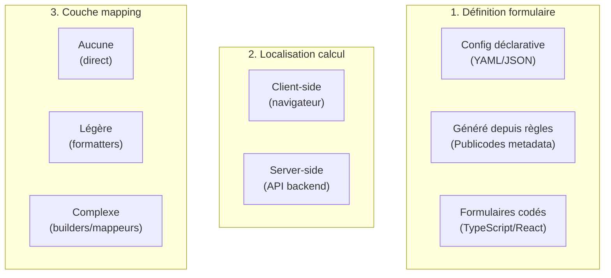
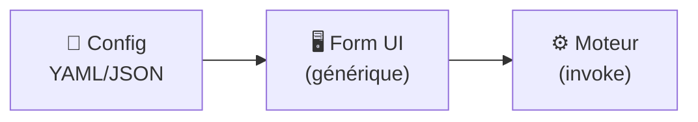
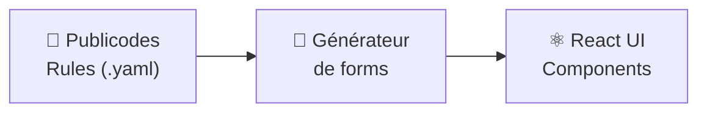
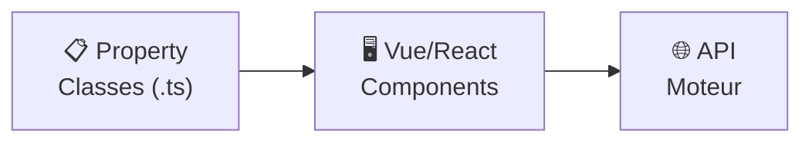
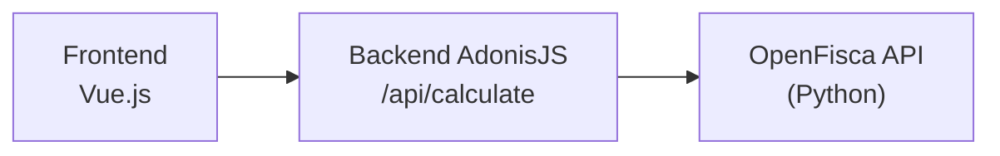
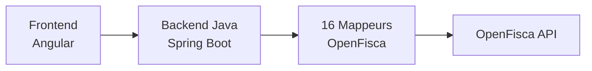
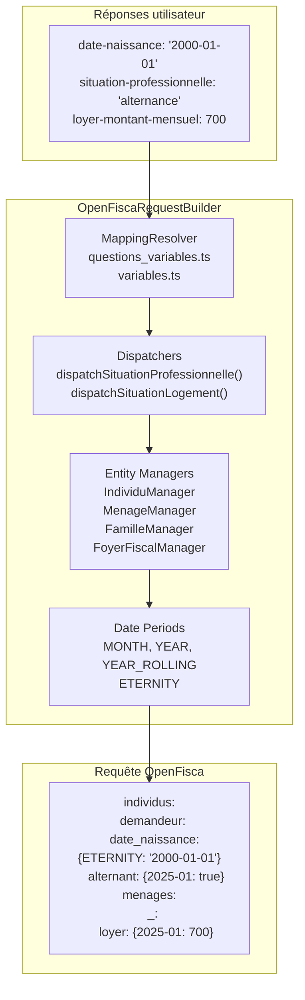

# Patterns architecturaux

Cette page détaille les principales architectures utilisées pour connecter formulaires et moteurs de règles dans l'écosystème des simulateurs publics.

## Vue d'ensemble

L'analyse des projets révèle **trois axes orthogonaux** qui se combinent :

1. **Définition du formulaire** : Comment les questions sont-elles décrites ?
2. **Localisation du calcul** : Où le moteur de règles s'exécute-t-il ?
3. **Couche de mapping** : Quelle transformation entre les réponses utilisateur et le moteur ?



### Combinaisons observées

| Projet | Définition | Calcul | Mapping | Moteur |
|--------|------------|--------|---------|--------|
| **aides-simplifiees** | JSON multi-moteur | Client + Proxy API | Builder TypeScript | Publicodes OU OpenFisca |
| **mes-aides-reno** | YAML priorités | Client | Direct | Publicodes |
| **mon-entreprise** | Généré depuis règles | Client | Direct | Publicodes |
| **nosgestesclimat** | YAML ordre | Client | Direct | Publicodes |
| **code-du-travail-numerique** | Généré depuis règles | Client | Direct | Publicodes |
| **aides-jeunes** | Codé (Property classes) | Hybride (serveur + client) | Intégré au code | OpenFisca + JavaScript |
| **estime** | Codé (Angular Forms) | Serveur (backend métier) | 16 mappeurs Java | OpenFisca |
| **leximpact** | Données JSON | Serveur (API) | Builder JavaScript | OpenFisca |
| **impact-co2** | Hybride (JSON + règles) | Client | Direct | Publicodes + données statiques |

---

## Axe 1 : Définition du formulaire

### Pattern A : Config déclarative (YAML/JSON)

Les questions sont décrites dans un fichier de configuration séparé du code applicatif.



#### Variante 1 : YAML comme filtre d'ordonnancement

**mes-aides-reno** utilise un YAML qui référence des règles Publicodes existantes :

```yaml
# simulationConfig.yaml
prioritaires:
  - vous . propriétaire . statut
  - logement . adresse
  - ménage . revenu
```

Les questions sont **définies dans Publicodes** (métadonnées `question:`, `une possibilité parmi:`). Le YAML ne fait que **filtrer et ordonner** les `missingVariables` du moteur.

#### Variante 2 : JSON comme schéma complet autonome

**aides-simplifiées** utilise un JSON qui décrit intégralement le formulaire :

```json
{
  "id": "demenagement-logement",
  "engine": "openfisca",
  "steps": [
    {
      "questions": [
        {
          "id": "date-naissance",
          "type": "date",
          "label": "Quelle est votre date de naissance ?",
          "required": true
        }
      ]
    }
  ]
}
```

Le formulaire est **indépendant du moteur**. Le champ `engine` permet de router vers Publicodes ou OpenFisca.

### Pattern B : Formulaire généré depuis les règles

L'UI est dérivée automatiquement des métadonnées Publicodes.



**mon-entreprise** utilise des composants `RuleInput` qui :
- Déterminent le type d'input selon la règle
- Affichent les suggestions et unités depuis les métadonnées
- Gèrent les conditions d'applicabilité automatiquement

### Pattern C : Formulaires codés

Les questions sont définies en TypeScript/JavaScript.



**aides-jeunes** définit des Property classes avec transformations intégrées :

```typescript
export const age: Property = {
  type: 'number',
  label: 'Quel est votre âge ?',
  toOpenFisca: (value) => ({ age: value })
}
```

---

## Axe 2 : Localisation du calcul

### Calcul côté client (navigateur)

Le moteur Publicodes s'exécute directement dans le navigateur.

**Avantages** :
- Pas de latence réseau
- Réactivité instantanée
- Pas de backend à maintenir

**Projets** : mes-aides-reno, mon-entreprise, nosgestesclimat, aides-simplifiées (mode Publicodes)

### Calcul côté serveur (API)

Le moteur (souvent OpenFisca/Python) est appelé via une API.

#### Variante : Proxy simple

**aides-simplifiées** utilise un backend AdonisJS qui fait un simple relais vers OpenFisca :



Le backend ne contient **aucune logique métier** : il relaye la requête construite côté client.

#### Variante : Backend avec logique métier

**estime** utilise un backend Java Spring qui transforme les données :



Le frontend envoie un objet métier (`DemandeurEmploi`), le backend le transforme en structure OpenFisca.

---

## Axe 3 : Couche de mapping (traçabilité)

::: warning Point d'attention
La couche de mapping est souvent **source de difficultés de traçabilité** entre les questions posées à l'utilisateur et les variables calculées par le moteur.
:::

### Mapping direct (aucune transformation)

Avec Publicodes côté client, les réponses alimentent directement les règles :

```typescript
engine.setSituation({ 'ménage . revenu': 25000 })
```

### Mapping avec formatters

**aides-simplifiées** utilise des formatters pour transformer les valeurs :

```typescript
// formatters.ts
export function formatSurveyAnswerToRequest(
  variableName: string,
  period: string,
  value: unknown
): Record<string, VariableValueOnPeriod> {
  return { [variableName]: { [period]: value } }
}
```

### Mapping avec builders complexes

Pour OpenFisca, **aides-simplifiées** utilise un `OpenFiscaRequestBuilder` avec plusieurs couches :



#### Exemple de transformation complexe

```typescript
// Entrée utilisateur
{ "situation-professionnelle": "alternance" }

// Dispatch (dispatchers.ts)
case FORM_VALUES.ALTERNANCE:
  return formatSurveyAnswerToRequest('alternant', period, true)

// Sortie OpenFisca
{
  "individus": {
    "demandeur": {
      "alternant": { "2025-01": true }
    }
  }
}
```

### Comparaison des approches de mapping

| Projet | Couche mapping | Traçabilité | Maintenabilité |
|--------|----------------|-------------|----------------|
| **mes-aides-reno** | Aucune (Publicodes direct) | ✅ Excellente | ✅ Simple |
| **aides-simplifiées (Publicodes)** | Légère | ✅ Bonne | ✅ Simple |
| **aides-simplifiées (OpenFisca)** | Builder TypeScript | ⚠️ Moyenne | ⚠️ Complexe |
| **aides-jeunes** | Intégrée au code | ⚠️ Moyenne | ⚠️ Dispersée |
| **estime** | 16 mappeurs Java | ❌ Difficile | ❌ Très complexe |

---

## Approches sans moteur déclaratif

Certains projets n'utilisent pas de moteur de règles générique :

| Projet | Approche | Justification |
|--------|----------|---------------|
| **envergo** | Moulinette Python (matrices, evaluators) | Règles environnementales très spécifiques |
| **pacoupa** | Lookup SQLite + validation Zod | Recommandation basée sur base de données |
| **a-just** | Algorithmes JavaScript custom | Calculs de charge tribunaux très spécifiques |

::: info Note sur impact-co2
**impact-co2** utilise en réalité une approche hybride : des données statiques (Base Empreinte ADEME, Agribalyse) combinées avec Publicodes (`publicodes 1.4.0` + `@incubateur-ademe/publicodes-acv-numerique`) pour certains calculs d'ACV numérique.
:::

---

## Matrice de décision

| Critère | Config déclarative | Généré (Publicodes) | Codé |
|---------|-------------------|---------------------|------|
| Contribution non-dev | ✅✅ | ✅ | ❌ |
| Cohérence règles/UI | ✅ | ✅✅ | ⚠️ |
| Flexibilité parcours | ✅✅ | ⚠️ | ✅✅ |
| Traçabilité | ✅ (si Publicodes) | ✅✅ | ⚠️ |
| Multi-moteur | ⚠️ (si prévu) | ❌ | ✅ |

| Critère | Calcul client | Calcul serveur (proxy) | Calcul serveur (métier) |
|---------|---------------|------------------------|------------------------|
| Latence | ✅✅ | ⚠️ | ❌ |
| Complexité infra | ✅✅ | ⚠️ | ❌ |
| Scalabilité | ✅ | ✅ | ✅✅ |
| Sécurité données | ⚠️ | ✅ | ✅✅ |

Légende : ✅✅ Excellent | ✅ Bon | ⚠️ Limité/Dépend | ❌ Non adapté

## Voir aussi

- [Panorama des projets](./01_panorama.md)
- [Outils réutilisables](./02_outils.md)
- [Ressources visuelles](/99_annexe/ressources-visuelles) - Diagrammes d'architecture et de traçabilité
- [Du modèle au schéma de questionnaire](/01_simulateurs/05_passer-en-code.html#du-modele-au-schema-de-questionnaire)
