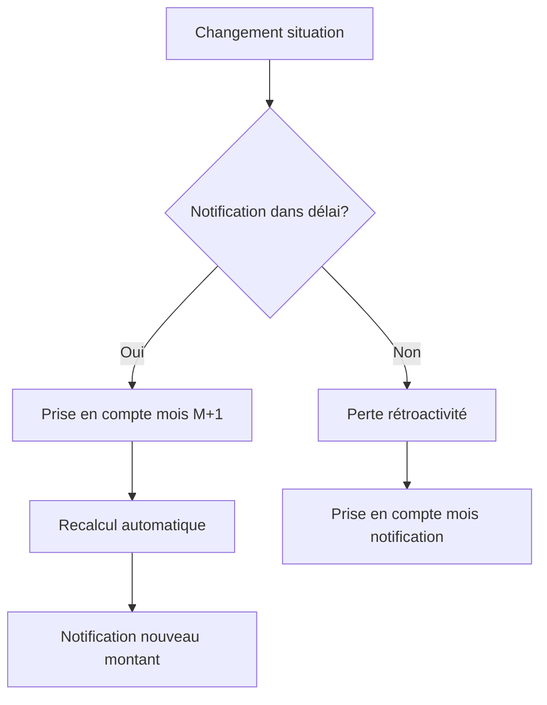

# Patterns et cas d'usage récurrents

Cette bibliothèque documente les patterns communs rencontrés dans la modélisation d'aides publiques, ainsi que les solutions éprouvées pour les traiter.

## Pourquoi une bibliothèque de patterns ?

Les équipes de simulateurs rencontrent régulièrement les mêmes difficultés :
- Gestion de la rétroactivité
- Cumul d'aides et règles d'incompatibilité
- Changements de situation en cours de période
- Cas limites et edge cases

Cette documentation permet d'éviter de "réinventer la roue" et de capitaliser sur l'expérience collective.

## Patterns métier

### Pattern 1 : Gestion de la rétroactivité

**Problème** : Une aide peut être demandée avec effet rétroactif (jusqu'à N mois en arrière). Comment modéliser cela ?

**Contexte d'apparition** :
- RSA (3 mois de rétroactivité)
- Prime d'activité (3 mois)
- APL (selon situations)

**Solution recommandée** :

```yaml
aide:
  retroactivite:
    autorisee: true
    duree_maximale_mois: 3
    conditions:
      - "demande_dans_delai"
      - "justificatifs_periode_complete"
    
  calcul:
    # Calculer l'aide pour chaque mois de la période rétroactive
    pour chaque mois in [mois_actuel - retroactivite...mois_actuel]:
      montant_mois = calculer_montant(situation_mois)
      total += montant_mois
    
    # Vérifier les règles de cumul sur chaque mois
    pour chaque mois:
      verifier_non_cumul_autres_aides(mois)
```

**Points d'attention** :
- Les ressources doivent être évaluées pour chaque mois concerné
- Les changements de situation en cours de période doivent être pris en compte
- Les autres aides perçues pendant cette période peuvent impacter l'éligibilité

**Exemple de test** :
```yaml
scenario: "Demande RSA rétroactive 2 mois"
date_demande: "2024-03-15"
periode_retroactive: ["2024-01", "2024-02", "2024-03"]
situation:
  janvier: 
    revenus: 400
    eligible: true
    montant: 607
  fevrier:
    revenus: 300  # Changement de situation
    eligible: true
    montant: 607
  mars:
    revenus: 500
    eligible: true
    montant: 607
total_retroactif: 1821
```

### Pattern 2 : Cumul et non-cumul d'aides

**Problème** : Comment gérer les règles de cumul entre plusieurs aides (cumulable, non-cumulable, cumul partiel) ?

**Contexte d'apparition** :
- RSA + Prime d'activité (incompatibles)
- APL + RSA (cumulables)
- Allocations familiales + diverses prestations (selon cas)

**Solution recommandée** :

```yaml
matrice_cumul:
  rsa:
    cumulable_avec:
      - apl
      - allocation_rentree_scolaire
      - allocation_familiales
    non_cumulable_avec:
      - prime_activite
      - aah  # sauf si montants différentiels
    cumul_partiel:
      aah:
        condition: "montant_aah < seuil"
        regle: "complement_differentiel"

  prime_activite:
    cumulable_avec:
      - apl
      - salaire  # avec abattement
      - allocation_familiales
    non_cumulable_avec:
      - rsa
```

**Implémentation suggérée** :

```python
def verifier_cumul(aide_demandee, aides_percues):
    """Vérifie si l'aide demandée est cumulable avec les aides déjà perçues"""
    regles_cumul = MATRICE_CUMUL[aide_demandee]
    
    for aide_percue in aides_percues:
        if aide_percue in regles_cumul['non_cumulable_avec']:
            return False, f"Non cumulable avec {aide_percue}"
        
        if aide_percue in regles_cumul['cumul_partiel']:
            regle = regles_cumul['cumul_partiel'][aide_percue]
            if not evaluer_condition(regle['condition']):
                return False, f"Cumul partiel non respecté pour {aide_percue}"
    
    return True, "Cumul autorisé"
```

**Points d'attention** :
- Maintenir la matrice de cumul à jour
- Tester tous les cas de cumul/non-cumul
- Documenter les sources juridiques pour chaque règle

### Pattern 3 : Changement de situation en cours de période

**Problème** : Comment gérer les changements de situation (naissance, déménagement, perte d'emploi) pendant la période de référence ?

**Contexte d'apparition** :
- Toutes les aides avec période de référence > 1 mois
- Particulièrement critique pour : APL, allocations familiales, RSA

**Solution recommandée** :

```yaml
gestion_changement_situation:
  types_evenements:
    - naissance_enfant
    - deces
    - demenagement
    - changement_situation_professionnelle
    - separation_couple
  
  regle_generale:
    notification_obligatoire: true
    delai_notification_jours: 30
    prise_effet: "mois_suivant_notification"
  
  impact_calcul:
    naissance_enfant:
      recalcul: "a_partir_du_mois_naissance"
      majoration: "selon_bareme"
    
    demenagement:
      recalcul: "a_partir_du_mois_demenagement"
      nouvelle_zone: "verification_zone_geographique"
    
    perte_emploi:
      recalcul: "immediat"
      revenus: "actualisation_mensuelle"
```

**Workflow type** :



### Pattern 4 : Plafonds et tranches

**Problème** : Comment modéliser des plafonds de ressources avec tranches progressives ?

**Contexte d'apparition** :
- Prime d'activité (bonus individuel par tranche)
- Barèmes progressifs
- Calculs par quotient familial

**Solution recommandée** :

```yaml
bareme_tranches:
  type: "progressif"  # ou "par_paliers"
  unite: "mensuel"
  
  tranches:
    - min: 0
      max: 0.5
      taux: 100%
      commentaire: "Revenus très faibles - taux plein"
    
    - min: 0.5
      max: 0.75
      taux: 50%
      commentaire: "Revenus modestes - taux réduit"
    
    - min: 0.75
      max: 1.0
      taux: 25%
      commentaire: "Revenus moyens - taux minimal"
    
    - min: 1.0
      max: null
      taux: 0%
      commentaire: "Au-dessus du plafond - non éligible"
  
  base_reference: "plafond_secu"  # ou montant fixe
  majoration_par_personne: 0.3
```

**Implémentation** :

```python
def calculer_montant_par_tranche(revenus, composition_foyer, bareme):
    """Calcule le montant en fonction du barème par tranches"""
    plafond_reference = bareme['base_reference']
    nb_parts = calculer_parts_foyer(composition_foyer)
    plafond_ajuste = plafond_reference * nb_parts
    
    ratio = revenus / plafond_ajuste
    
    for tranche in bareme['tranches']:
        if tranche['min'] <= ratio < (tranche['max'] or float('inf')):
            montant_base = bareme['montant_base']
            return montant_base * tranche['taux']
    
    return 0  # Au-dessus de toutes les tranches
```

### Pattern 5 : Gestion des ressources N-1 vs N-3

**Problème** : Certaines aides utilisent les ressources de l'année N-1, d'autres du trimestre précédent (N-3 mois).

**Contexte d'apparition** :
- APL : ressources 12 derniers mois
- RSA : ressources 3 derniers mois
- Allocations familiales : ressources année N-2

**Solution recommandée** :

```yaml
definition_periode_reference:
  aide_1_apl:
    type: "glissant_annuel"
    periode: "12_derniers_mois"
    source: "declaration_ou_avis_imposition"
    actualisation: "mensuelle_possible"
  
  aide_2_rsa:
    type: "glissant_trimestriel"
    periode: "3_derniers_mois"
    source: "declaration_mensuelle"
    actualisation: "obligatoire_chaque_trimestre"
  
  aide_3_allocations:
    type: "annuel_fixe"
    periode: "annee_n_moins_2"
    source: "avis_imposition"
    actualisation: "annuelle_automatique"
```

**Points d'attention** :
- Clarifier la période de référence dans l'interface utilisateur
- Prévoir la saisie ou récupération des données sur la bonne période
- Gérer les cas de non-déclaration ou déclaration partielle

## Patterns techniques

### Pattern 6 : Validation des saisies utilisateur

**Problème** : Comment valider les données saisies par l'utilisateur de manière cohérente ?

**Solution recommandée** :

```javascript
const validations = {
  age: {
    type: 'number',
    min: 0,
    max: 120,
    message: "L'âge doit être compris entre 0 et 120 ans"
  },
  
  revenus: {
    type: 'number',
    min: 0,
    max: 999999,
    format: 'currency',
    message: "Veuillez saisir un montant valide"
  },
  
  code_postal: {
    type: 'string',
    pattern: /^[0-9]{5}$/,
    message: "Le code postal doit contenir 5 chiffres"
  },
  
  composition_foyer: {
    type: 'object',
    validate: (value) => {
      return value.adultes >= 1 && value.enfants >= 0;
    },
    message: "Le foyer doit contenir au moins 1 adulte"
  }
};
```

### Pattern 7 : Gestion des erreurs et messages

**Problème** : Comment communiquer clairement les résultats, notamment les non-éligibilités ?

**Solution recommandée** :

```yaml
messages_resultat:
  eligible:
    titre: "Vous êtes éligible !"
    template: "Vous pouvez bénéficier de {montant}€ par mois."
    actions:
      - label: "Faire une demande"
        url: "{url_organisme}"
      - label: "En savoir plus"
        url: "{url_info}"
  
  non_eligible_age:
    titre: "Vous n'êtes pas éligible"
    template: "Cette aide est réservée aux personnes de {age_min} à {age_max} ans."
    raison: "age_hors_limite"
    suggestions:
      - aide_alternative_1
      - aide_alternative_2
  
  non_eligible_revenus:
    titre: "Vous n'êtes pas éligible"
    template: "Vos ressources ({revenus}€) dépassent le plafond ({plafond}€)."
    raison: "revenus_trop_eleves"
    explication: "Le plafond est calculé en fonction de votre composition familiale."
```

**Principes** :
- Toujours expliquer **pourquoi** la personne n'est pas éligible
- Proposer des **alternatives** quand c'est possible
- Utiliser un **langage simple** et empathique
- Fournir des **liens vers les organismes** compétents

### Pattern 8 : Tests de non-régression

**Problème** : Comment garantir qu'une modification ne casse pas les calculs existants ?

**Solution recommandée** :

```python
# Structure de test recommandée
import pytest

@pytest.fixture
def personas_valides():
    """Charge tous les personas validés par l'expert métier"""
    return charger_personas_yaml('personas_valides.yml')

def test_non_regression_tous_personas(personas_valides):
    """Vérifie que tous les personas donnent les résultats attendus"""
    for persona in personas_valides:
        simulation = creer_simulation(persona['variables'])
        
        for aide, attendu in persona['resultats_attendus'].items():
            resultat = simulation.calculer(aide)
            
            assert resultat['eligible'] == attendu['eligible'], \
                f"Persona {persona['id']}: éligibilité différente pour {aide}"
            
            if resultat['eligible']:
                ecart = abs(resultat['montant'] - attendu['montant_estime'])
                tolerance = attendu.get('tolerance', 1)  # 1€ de tolérance par défaut
                
                assert ecart <= tolerance, \
                    f"Persona {persona['id']}: montant {aide} = {resultat['montant']}, " \
                    f"attendu {attendu['montant_estime']} (écart: {ecart}€)"

def test_non_regression_snapshot():
    """Vérifie que les résultats n'ont pas changé depuis la dernière version validée"""
    resultats_actuels = executer_tous_cas_tests()
    resultats_reference = charger_snapshot('v1.2.3')
    
    assert resultats_actuels == resultats_reference, \
        "Des résultats ont changé depuis la dernière version"
```

## Cas d'usage documentés

### Cas 1 : Famille monoparentale avec enfant scolarisé

**Situation type** :
- Parent seul avec 1 enfant de 7 ans
- Revenus : 1200€/mois (temps partiel)
- Locataire, loyer : 600€/mois
- Zone géographique : Zone 2

**Aides potentielles** :
- ✅ APL (éligible)
- ✅ Prime d'activité (éligible)
- ✅ Allocation de rentrée scolaire (éligible)
- ✅ Allocations familiales (non, 1 seul enfant)

**Points de complexité** :
- Cumul APL + Prime d'activité (autorisé)
- Calcul de l'allocation de rentrée (date de rentrée scolaire)
- Impact du temps partiel sur la prime d'activité

**Solution et tests** : Voir [persona famille-monoparentale-1-enfant](01_standards-formats.md#structure-yaml-recommandee)

### Cas 2 : Jeune en alternance

**Situation type** :
- 19 ans, contrat d'apprentissage
- Salaire : 800€/mois
- Non rattaché fiscalement aux parents
- Locataire chambre CROUS : 250€/mois

**Aides potentielles** :
- ✅ APL étudiant (éligible)
- ❌ Prime d'activité (non, salaire d'apprentissage exonéré jusqu'à un seuil)
- ✅ Aide mobili-jeune (éligible)

**Points de complexité** :
- Statut hybride (salarié + étudiant)
- Règles spécifiques aux apprentis
- Ressources à prendre en compte (salaire vs revenus parents)

### Cas 3 : Transition chômage → emploi

**Situation type** :
- Personne seule, 35 ans
- Mois 1-2 : Chômage (ARE 1100€)
- Mois 3 : Reprise emploi (salaire 1600€)

**Aides potentielles** :
- Mois 1-2 : ✅ Prime d'activité (non, ARE ne compte pas)
- Mois 3 : ✅ Prime d'activité (éligible, bonus reprise d'activité)

**Points de complexité** :
- Changement de situation en cours de trimestre
- Calcul sur ressources trimestrielles glissantes
- Bonus reprise d'activité (règles spécifiques)

## Contribuer à la bibliothèque

### Proposer un nouveau pattern

Si vous rencontrez un problème récurrent non documenté ici :

1. **Ouvrir une issue** sur [GitHub](https://github.com/betagouv/aides-simplifiees-docs/issues)
2. **Décrire le problème** : contexte, difficultés, tentatives de solution
3. **Proposer une solution** : si vous en avez une qui fonctionne
4. **Partager vos tests** : exemples concrets

### Format de contribution

```markdown
### Pattern X : [Titre du pattern]

**Problème** : [Description du problème]

**Contexte d'apparition** : [Dans quelles aides ce problème apparaît-il ?]

**Solution recommandée** : [Solution détaillée avec code/config]

**Points d'attention** : [Pièges à éviter]

**Exemple de test** : [Cas concret]
```

::: tip
Plus nous documentons nos difficultés et solutions, moins les équipes suivantes perdront de temps sur les mêmes problèmes !
:::

## Ressources complémentaires

- [Standards et formats](01_standards-formats.md) pour les structures de données
- [Protocoles de collaboration](02_protocoles.md) pour la validation métier
- [Tests et ajustements](/01_simulateurs/05_tester-ajuster.md) pour approfondir les stratégies de test
