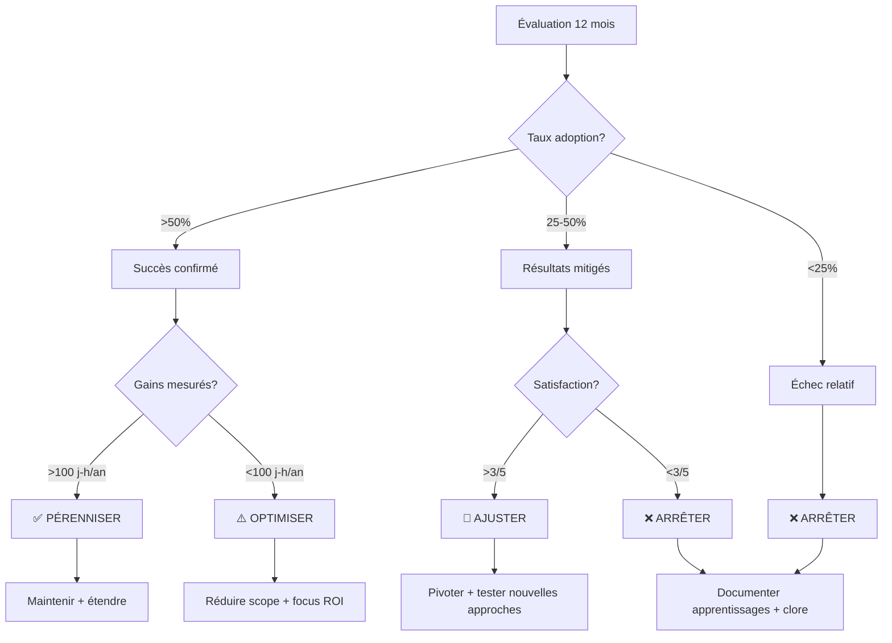

# Mesure du succès et indicateurs

Cette page présente les métriques et indicateurs permettant d'évaluer l'efficacité de la mutualisation et l'amélioration continue des pratiques.

## Pourquoi mesurer ?

La mutualisation n'a de sens que si elle apporte une **valeur mesurable** aux équipes et aux usagers. Les indicateurs permettent de :
- Justifier l'investissement dans les ressources partagées
- Identifier ce qui fonctionne et ce qui doit être amélioré
- Décider collectivement de poursuivre, ajuster ou arrêter
- Démontrer les gains réalisés aux parties prenantes

## Indicateurs par horizon

### Court terme (3 mois) : Quick wins

**Objectif** : Premiers gains tangibles et création d'une dynamique

| Indicateur | Cible | Mesure |
|-----------|-------|--------|
| **Équipes ayant testé au moins une ressource** | 3+ équipes | Suivi GitHub, enquête |
| **Ressources partagées** | 5+ ressources | Comptage docs, templates, personas |
| **Temps gagné sur un projet pilote** | -10% | Comparaison avec projet précédent |
| **Satisfaction équipes pilotes** | 4/5 | Enquête satisfaction |

**Actions de mesure** :
- Tracker les téléchargements/consultations des ressources partagées
- Interviews courtes avec équipes pilotes (15 min)
- Journalisation du temps passé sur tâches communes

### Moyen terme (6 mois) : Consolidation

**Objectif** : Adoption élargie et gains confirmés

| Indicateur | Cible | Mesure |
|-----------|-------|--------|
| **Équipes adoptant des standards** | 50%+ des équipes actives | Analyse dépôts GitHub |
| **Réduction temps de développement** | -20 à -40% | Enquête rétrospective |
| **Contributions à la base commune** | 10+ contributions | Comptage PR GitHub |
| **Bugs évités grâce aux patterns** | 3+ cas documentés | Retours équipes |
| **Satisfaction globale** | 3.5/5 | Enquête trimestrielle |

**Actions de mesure** :
- Questionnaire structuré envoyé à toutes les équipes
- Analyse des commits mentionnant les ressources partagées
- Collecte de témoignages et cas d'usage

### Long terme (12 mois) : Décision

**Objectif** : Bilan factuel et décision collective sur la pérennisation

| Indicateur | Seuil succès | Seuil ajustement | Seuil abandon |
|-----------|--------------|------------------|---------------|
| **Taux d'adoption** | >50% | 25-50% | <25% |
| **Économies estimées** | >100 j-h/an | 50-100 j-h/an | <50 j-h/an |
| **Satisfaction moyenne** | >3.5/5 | 2.5-3.5/5 | <2.5/5 |
| **Dynamique contributive** | Croissante | Stable | Décroissante |

**Actions de mesure** :
- Audit complet de l'adoption et de l'usage
- Calcul du ROI basé sur les gains de temps mesurés
- Atelier de décision collective avec toutes les équipes

## Métriques détaillées

### 1. Gain de temps

**Comment mesurer** :

```
Temps gagné = Temps projet sans mutualisation - Temps projet avec mutualisation

Exemple concret :
- Projet A (sans) : 4 mois de développement complet
- Projet B (avec) : 2.5 mois (réutilisation personas + composants + patterns)
- Gain : 1.5 mois = 37.5% de réduction
```

**Méthode de collecte** :
1. Identifier 2 projets comparables (même complexité)
2. Mesurer le temps effectif passé sur chaque étape :
   - Modélisation : X jours
   - Développement : Y jours
   - Tests : Z jours
3. Comparer et calculer l'écart

### 2. Qualité et bugs évités

**Comment mesurer** :
- Nombre de bugs en production liés à des règles métier
- Temps de résolution moyen d'un bug
- Nombre de régressions détectées avant production

**Méthode de collecte** :
- Analyse des issues GitHub taggées "bug métier"
- Enquête auprès des équipes : "Avez-vous évité des erreurs grâce aux patterns partagés ?"

### 3. Adoption et engagement

**Comment mesurer** :
- Nombre de projets utilisant au moins une ressource mutualisée
- Nombre de contributions (PR, issues, suggestions)
- Participation aux ateliers et discussions

**Méthode de collecte** :
- Analyse automatique des dépôts (imports, références)
- Comptage des participations aux événements
- Sondages réguliers

### 4. Satisfaction des équipes

**Questionnaire type** :

```markdown
## Enquête mutualisation - [Trimestre]

**Contexte** : Nous souhaitons mesurer l'utilité des ressources mutualisées.

### Utilisation
1. Avez-vous utilisé des ressources mutualisées ce trimestre ? (Oui/Non)
2. Si oui, lesquelles ? (liste à choix multiples)
3. À quelle fréquence ? (Jamais / Rarement / Parfois / Souvent / Très souvent)

### Valeur perçue
4. Ces ressources vous ont-elles fait gagner du temps ? (Échelle 1-5)
5. Ont-elles amélioré la qualité de votre travail ? (Échelle 1-5)
6. Ont-elles facilité la collaboration dans votre équipe ? (Échelle 1-5)

### Amélioration
7. Qu'est-ce qui fonctionne bien ?
8. Qu'est-ce qui pourrait être amélioré ?
9. Quelle ressource manquante serait la plus utile ?

### Engagement
10. Seriez-vous prêt(e) à contribuer des ressources ? (Oui / Peut-être / Non)
11. Combien de temps pourriez-vous y consacrer par mois ? (0h / 1-2h / 3-5h / 5h+)
```

## Tableau de bord

### Vue d'ensemble mensuelle

```
┌─────────────────────────────────────────────────────────────┐
│ MUTUALISATION - Dashboard Mois M                            │
├─────────────────────────────────────────────────────────────┤
│                                                              │
│ 📊 ADOPTION                                                  │
│   • Équipes actives : 12 / 20 (60%) ↗                       │
│   • Nouvelles adoptions ce mois : 2                         │
│   • Ressources les plus utilisées :                         │
│     1. Personas de test (8 équipes)                         │
│     2. Template modélisation (6 équipes)                    │
│     3. Patterns rétroactivité (5 équipes)                   │
│                                                              │
│ ⏱️ GAIN DE TEMPS                                             │
│   • Temps gagné estimé ce mois : 45 jours-homme            │
│   • Gain moyen par projet : -25%                            │
│                                                              │
│ 🤝 CONTRIBUTIONS                                             │
│   • Nouvelles contributions : 3                             │
│   • Issues ouvertes : 5                                     │
│   • PRs mergées : 2                                         │
│                                                              │
│ 😊 SATISFACTION                                              │
│   • Note moyenne : 4.1 / 5                                  │
│   • Taux de réponse enquête : 70%                           │
│                                                              │
└─────────────────────────────────────────────────────────────┘
```

### Évolution trimestrielle

| Trimestre | Équipes actives | Temps gagné (j-h) | Satisfaction | Contributions |
|-----------|----------------|-------------------|--------------|---------------|
| T1 2025   | 3 (15%)        | 15                | 3.8/5        | 5             |
| T2 2025   | 7 (35%)        | 60                | 4.0/5        | 8             |
| T3 2025   | 12 (60%)       | 120               | 4.1/5        | 12            |
| T4 2025   | ? (cible 70%)  | ? (cible 150)     | ? (cible 4.2)| ? (cible 15)  |

## Processus de décision

### Seuils de décision à 12 mois



### Critères de décision

**Pérenniser** si :
- ✅ Adoption > 50%
- ✅ Gains mesurés > 100 jours-homme/an
- ✅ Satisfaction > 3.5/5
- ✅ Dynamique contributive positive

➡️ **Action** : Maintenir l'animation, étendre les ressources, documenter les succès

**Ajuster** si :
- ⚠️ Adoption 25-50%
- ⚠️ Gains mesurés 50-100 jours-homme/an
- ⚠️ Satisfaction 2.5-3.5/5
- ⚠️ Dynamique stable ou lente

➡️ **Action** : Identifier les freins, pivoter sur ce qui fonctionne, réduire le scope

**Arrêter** si :
- ❌ Adoption < 25%
- ❌ Gains mesurés < 50 jours-homme/an
- ❌ Satisfaction < 2.5/5
- ❌ Dynamique décroissante

➡️ **Action** : Documenter les apprentissages, archiver proprement, libérer les ressources

## Transparence et communication

### Rapports publics

Tous les 3 mois, publication d'un rapport public incluant :
- Synthèse des indicateurs
- Témoignages d'équipes
- Défis rencontrés
- Prochaines étapes

**Format** : Document Markdown + présentation en atelier

### Atelier de bilan annuel

Organisation d'un atelier collectif pour :
1. Présenter les résultats factuels
2. Recueillir les ressentis qualitatifs
3. Décider collectivement de la suite
4. Définir les priorités si poursuite

**Participants** : Représentants de toutes les équipes de simulateurs

## Amélioration continue

### Rétrospectives trimestrielles

**Questions à poser** :
1. Qu'est-ce qui a bien fonctionné ce trimestre ?
2. Qu'est-ce qui a moins bien fonctionné ?
3. Qu'est-ce qu'on devrait commencer à faire ?
4. Qu'est-ce qu'on devrait arrêter de faire ?
5. Qu'est-ce qu'on devrait continuer à faire ?

**Format** : Session de 1h30 avec équipes volontaires

### Adaptation des ressources

En fonction des retours :
- Archiver ce qui n'est pas utilisé
- Enrichir ce qui est plébiscité
- Créer ce qui est demandé par 3+ équipes
- Simplifier ce qui est jugé trop complexe

## Conclusion

La mesure n'est pas une fin en soi, mais un outil de pilotage collectif. Elle permet de :
- **Rester pragmatique** : arrêter ce qui ne fonctionne pas
- **Valoriser les gains** : montrer les bénéfices réels
- **Justifier l'investissement** : prouver le ROI
- **Décider ensemble** : sur des bases factuelles

::: tip
Tous les indicateurs et résultats sont publiés de manière transparente. Rien n'est caché, tout est discutable.
:::

## Ressources

- [Protocoles de collaboration](/02_mutualisation/02_protocoles.md) pour organiser les interactions
- [Standards et formats](/02_mutualisation/01_standards-formats.md) pour structurer les ressources
- [Patterns](/02_mutualisation/03_patterns.md) pour résoudre les problèmes courants
