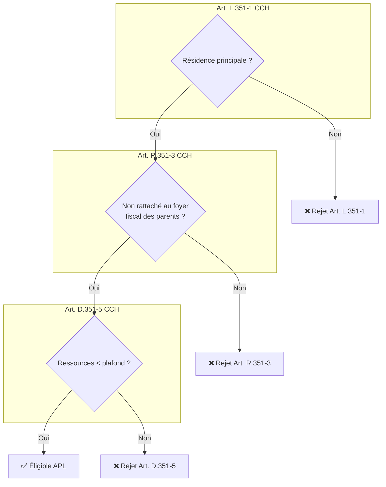
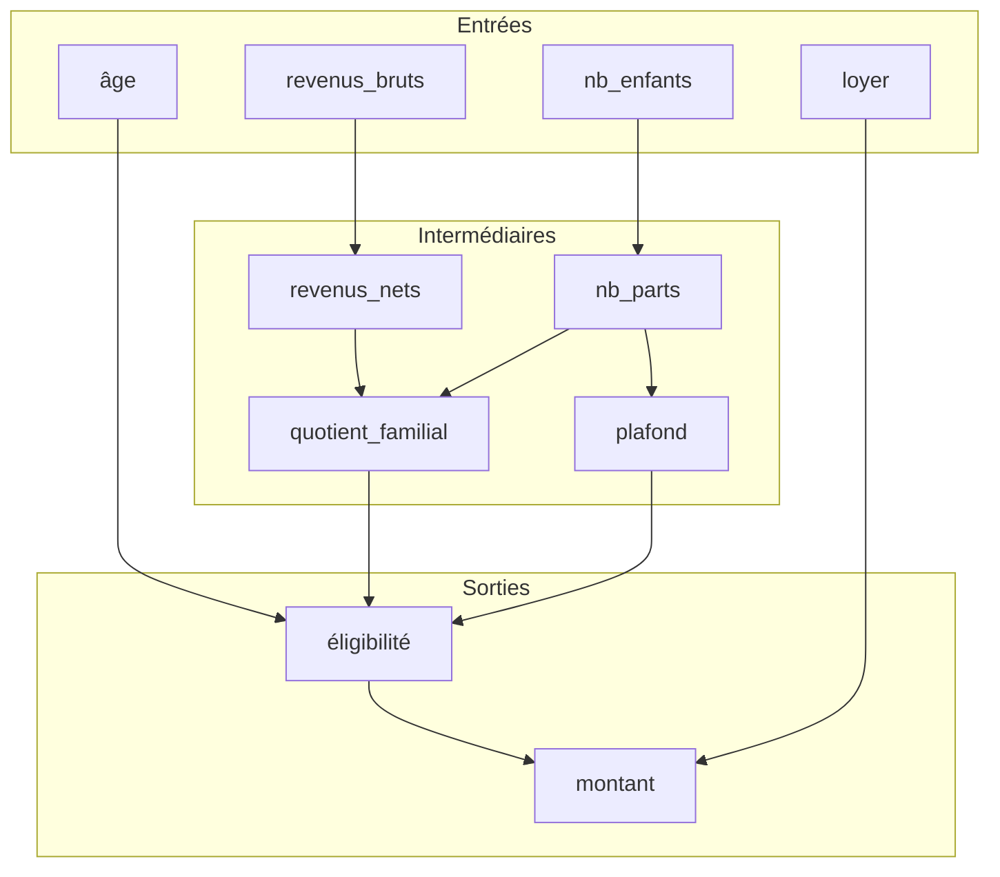
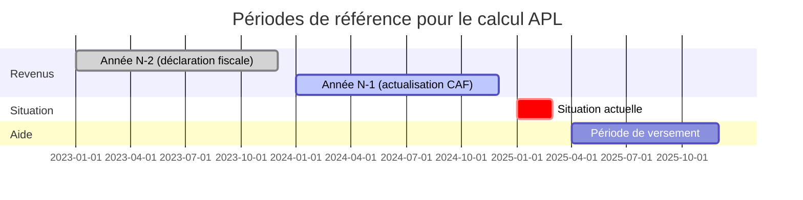
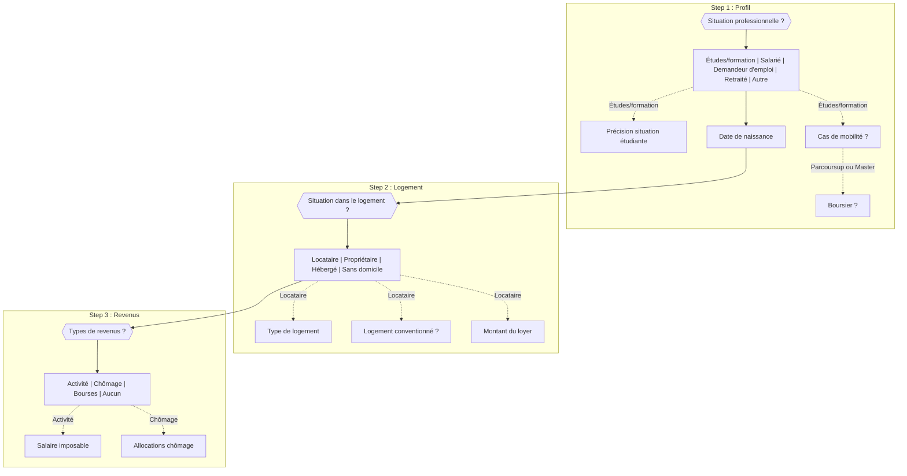
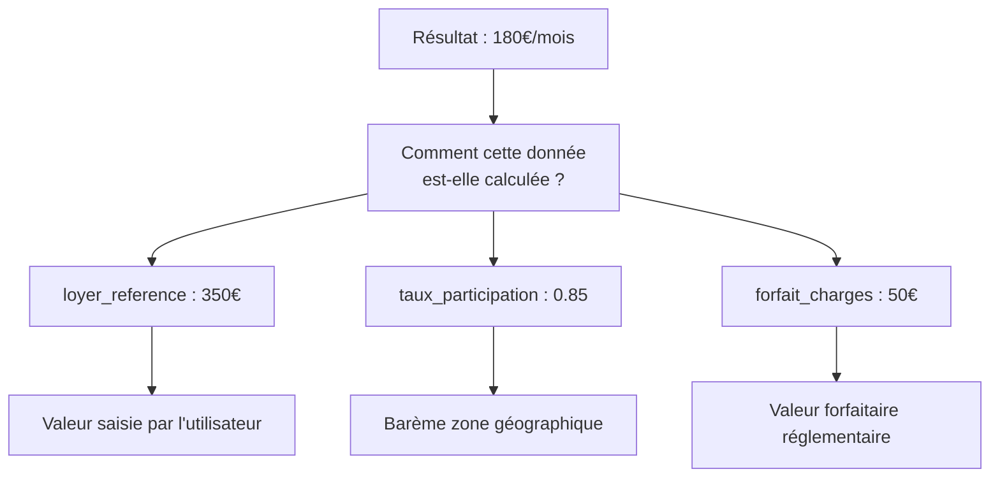
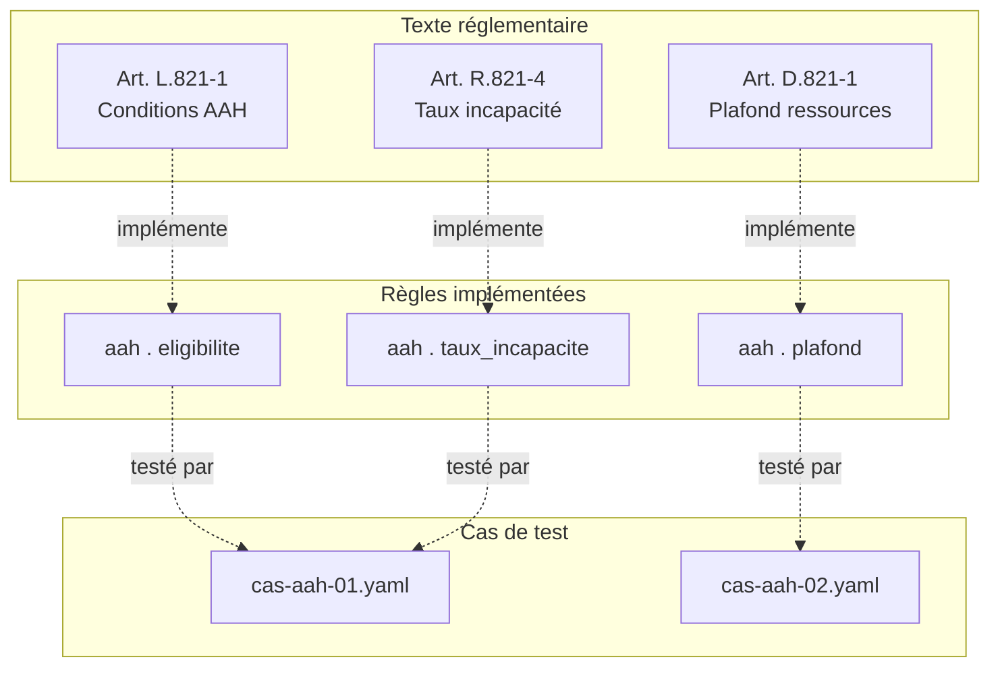

# Ressources visuelles

Cette page regroupe des diagrammes réutilisables pour représenter les objets manipulés dans un projet de simulateur. Ces schémas servent de **support de discussion** entre développeurs, experts métier, designers, product owners et autres parties prenantes.

Ils sont organisés selon les phases de conception d'un simulateur :

1. **Modélisation** : comprendre et formaliser les règles juridiques
2. **Conception du parcours** : définir les questions et leur enchaînement
3. **Implémentation** : documenter l'architecture technique
4. **Maintenance** : suivre la couverture et les évolutions

## Phase 1 : Modélisation des règles

### Arbre de décision avec sources légales

Les conditions d'éligibilité sont souvent décrites en prose juridique. Ce format les traduit en structure logique, avec annotation de la source pour chaque branche :



**Quand l'utiliser** : en début de modélisation, pour valider avec l'expert métier que la logique d'éligibilité est correcte.

### Graphe de dépendances entre variables

Dans un modèle de calcul, certaines variables dépendent d'autres. Ce schéma explicite ces relations :



**Quand l'utiliser** : pour comprendre l'impact d'une modification réglementaire ("si le plafond change, quelles règles sont affectées ?"), ou pour expliquer à un non-technicien comment le calcul fonctionne.

### Périodes de référence

Les aides sociales utilisent des revenus décalés dans le temps. Ce diagramme clarifie les temporalités :



**Quand l'utiliser** : pour expliquer aux utilisateurs pourquoi le simulateur demande des revenus de 2023 en 2025, ou pour clarifier avec l'équipe technique quelle période utiliser pour chaque variable.

## Phase 2 : Conception du parcours

### Parcours déclaratif (aides-simplifiées)

L'approche déclarative consiste à décrire le formulaire dans un fichier JSON autonome, indépendant du moteur de règles. Ce schéma définit les étapes, les questions, et les **conditions d'affichage** qui déterminent quand une question apparaît.

Le schéma JSON se découpe en **steps** (étapes) contenant des **questions**. Chaque question peut avoir une propriété `visibleWhen` qui conditionne son affichage selon les réponses précédentes.

Exemple extrait du simulateur "Déménagement et logement" :



**Légende** : les flèches pleines représentent le flux principal (questions toujours affichées). Les flèches pointillées représentent l'affichage conditionnel (`visibleWhen`).

**Quand l'utiliser** : avant l'implémentation, pour que PO, designer et expert métier valident ensemble le parcours. Permet de vérifier que les questions pertinentes sont posées aux bonnes personnes (un retraité ne devrait pas voir les questions sur les bourses).

### Depuis le JSON vers le diagramme

Le schéma JSON contient toutes les informations nécessaires pour générer ce diagramme :

```json
{
  "id": "situation-professionnelle",
  "title": "Précisez votre situation professionnelle",
  "type": "radio",
  "visibleWhen": "statut-professionnel=etudiant",
  "choices": [...]
}
```

La propriété `visibleWhen` se traduit directement en flèche conditionnelle. Cette approche déclarative permet de **découpler le parcours utilisateur du moteur de calcul** : le même schéma JSON peut interroger OpenFisca ou Publicodes selon le champ `engine`.

## Phase 3 : Implémentation

### Explicabilité des calculs

Un simulateur qui donne un résultat sans explication inspire peu confiance. L'explicabilité consiste à montrer à l'utilisateur **comment** le calcul a été fait, pas seulement le résultat final.

#### L'exemple de @publicodes/react-ui

Le package `@publicodes/react-ui` fournit des composants React qui affichent automatiquement la documentation interactive d'un moteur Publicodes. Quelques composants clés :

- **`RulePage`** : affiche la page de documentation complète d'une règle, avec sa valeur calculée, ses dépendances, et le détail du calcul
- **`Explanation`** : affiche le détail d'un nœud de calcul, avec décomposition récursive des sous-règles
- **`RuleLink`** : crée un lien cliquable vers la documentation d'une règle, permettant la navigation dans le graphe de calcul

L'idée : depuis un résultat de simulation, l'utilisateur peut "remonter" le calcul pour comprendre d'où vient chaque valeur intermédiaire.



#### Explicabilité en pratique

Concrètement, intégrer l'explicabilité dans un simulateur implique :

1. **Lien vers la documentation** : depuis la page de résultat, proposer un lien "Comprendre ce calcul" qui ouvre la documentation de la règle principale
2. **Navigation dans les dépendances** : chaque variable intermédiaire est cliquable et montre sa propre explication
3. **Références juridiques** : les règles Publicodes peuvent contenir une propriété `références` qui liste les articles de loi sources

Cette transparence permet à l'utilisateur de vérifier que le calcul correspond à sa situation, et aux partenaires institutionnels de valider que l'implémentation respecte les textes.

## Phase 4 : Maintenance et suivi

### Traçabilité droit → code

Ce schéma établit la correspondance entre articles réglementaires, règles implémentées et cas de test :



**Quand l'utiliser** : lors des revues métier pour répondre à "est-ce que l'article R.351-3 est bien couvert ?", ou lors d'une mise à jour réglementaire pour identifier les règles à modifier.

## Ce qui existe et ce qui manque

### Outils textuels
**Mermaid** est un format texte versionnable, intégrable dans des fichiers Markdown, supporté par plusieurs outils, notamment GitHub et GitLab. Un diagramme mermaid à l'avantage de pouvoir être versionné, et potentiellemnt généré automatiquement à partir de sources existantes (fichiers JSON, code Publicodes/OpenFisca).

### Outils graphiques
Plusieurs outils comme **Excalidraw** ou **Draw.io** sont utilisés pour créer des diagrammes graphiques. Ils sont utiles en atelier pour explorer des idées, mais moins adaptés pour la documentation pérenne car difficiles à versionner et à maintenir.

### Ce qui pourrait exister

Les diagrammes présentés ici sont créés manuellement. Or, les informations nécessaires existent déjà dans le code ou les fichiers de configuration. Des outils pourraient les générer automatiquement :

- **Générateur de parcours depuis le JSON** : transformer automatiquement un schéma déclaratif aides-simplifiées en diagramme Mermaid, avec les conditions d'affichage
- **Visualiseur de dépendances Publicodes** : générer le graphe de dépendances entre variables depuis les règles, avec navigation interactive
- **Carte de couverture réglementaire** : croiser les articles de loi annotés dans le code avec les cas de test existants, pour identifier les zones non couvertes
- **Timeline interactive des périodes** : permettre à l'utilisateur de voir quelles données le concernent selon sa date de simulation
- **Outils IA** : utiliser l'IA pour générer des diagrammes à partir de descriptions textuelles ou de code source

Ces outils n'existent pas encore sous forme packagée. Leur développement pourrait significativement réduire l'effort de documentation et améliorer la collaboration métier-technique.

## Bonnes pratiques

**Versionner** : un diagramme Mermaid peut être reviewé dans une PR. Les modifications sont traçables.

**Lier aux sources** : chaque diagramme devrait pointer vers les documents de référence (articles de loi, fichiers de code).


## Voir aussi

- [Collaboration métier-produit](/02_ecosysteme/04_collaboration) — Formats de cas types, glossaire, registre d'interprétations
- [Modéliser une aide](/01_simulateurs/02_modeliser-une-aide) — Processus complet de modélisation
- [Patterns architecturaux](/02_ecosysteme/03_patterns) — Choix techniques formulaire/moteur
