# Ressources visuelles mutualisables

Ce document recense les **diagrammes et templates visuels** utiles pour :
- Améliorer la traçabilité entre texte réglementaire et code
- Faciliter la collaboration métier / produit / tech
- Documenter les architectures de simulateurs

Tous les templates sont en **Mermaid** (versionnables, intégrables dans VitePress/GitHub).

---

## 1. MODÉLISATION DES RÈGLES

### 1.1 Arbre de décision d'éligibilité

**Usage** : Visualiser les conditions d'éligibilité d'une aide pour validation métier.

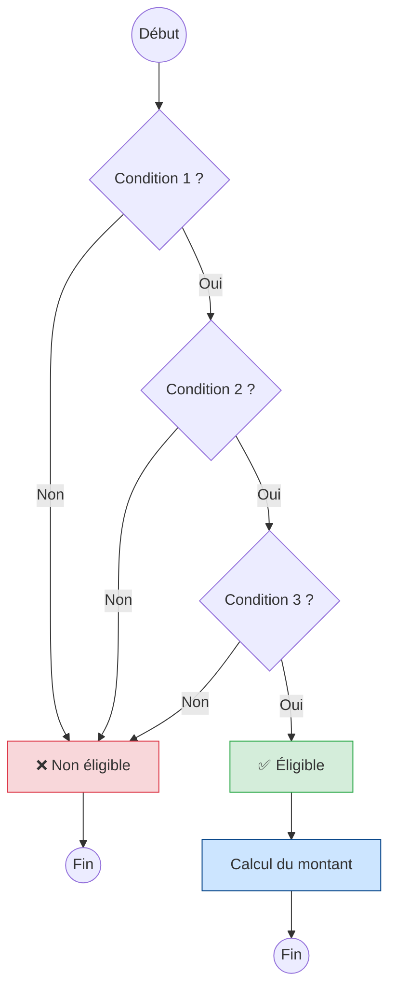

**Template personnalisable** :

```
flowchart TD
    START((Début)) --> Q1{[CONDITION_1] ?}
    Q1 -->|Oui| Q2{[CONDITION_2] ?}
    Q1 -->|Non| REJECT[❌ Non éligible<br/>Motif: [MOTIF_1]]
    Q2 -->|Oui| ELIGIBLE[✅ Éligible]
    Q2 -->|Non| REJECT2[❌ Non éligible<br/>Motif: [MOTIF_2]]
```

---

### 1.2 Logigramme avec références légales

**Usage** : Documenter la traçabilité condition → article de loi.

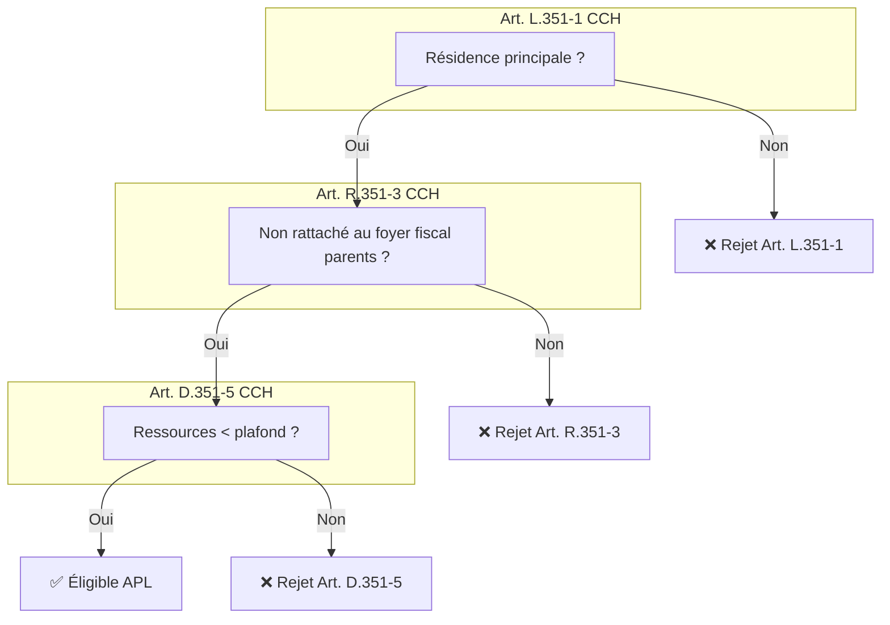

---

### 1.3 Graphe de dépendances entre variables

**Usage** : Comprendre les relations entre variables d'un modèle.

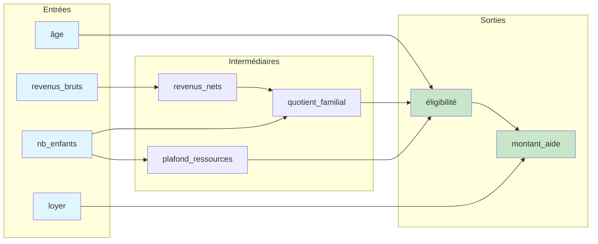

---

### 1.4 Timeline des périodes de calcul

**Usage** : Clarifier les temporalités (revenus N-1, N-2, projection).


---

## 2. ARCHITECTURE TECHNIQUE

### 2.1 Flux formulaire → moteur → résultat

**Usage** : Documenter l'architecture complète d'un simulateur.

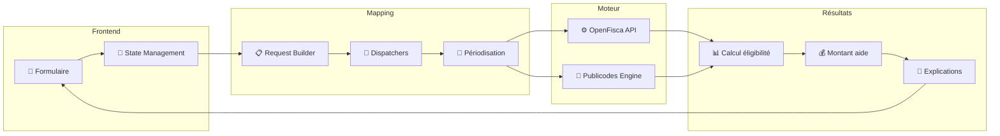

---

### 2.2 Détail de la couche de mapping (traçabilité)

**Usage** : Documenter la transformation réponses utilisateur → variables moteur.

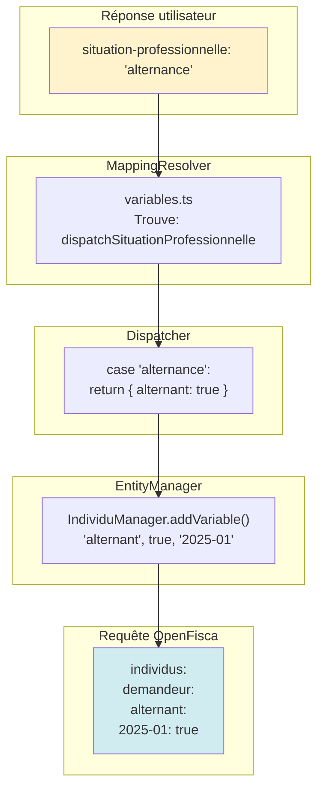

---

### 2.3 Architecture multi-moteur

**Usage** : Documenter un système hybride (Publicodes + OpenFisca).

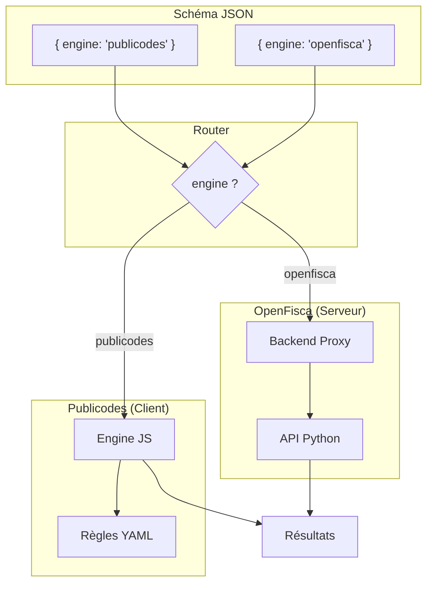

---

## 3. COLLABORATION MÉTIER-PRODUIT

### 3.1 Workflow de validation métier

**Usage** : Documenter le processus de validation des règles.

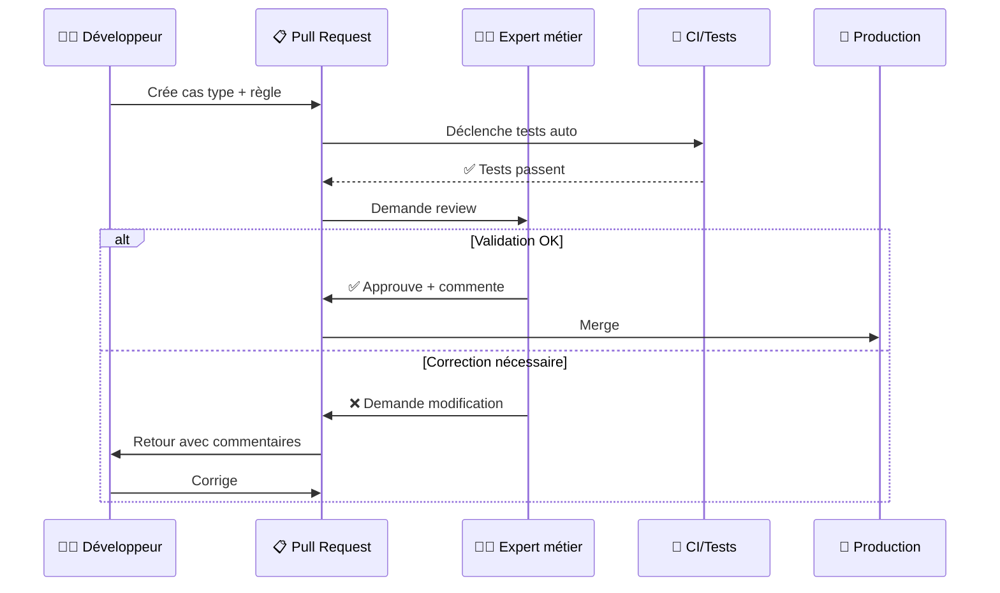

---

### 3.2 Matrice RACI projet simulateur

**Usage** : Clarifier les responsabilités dans l'équipe.

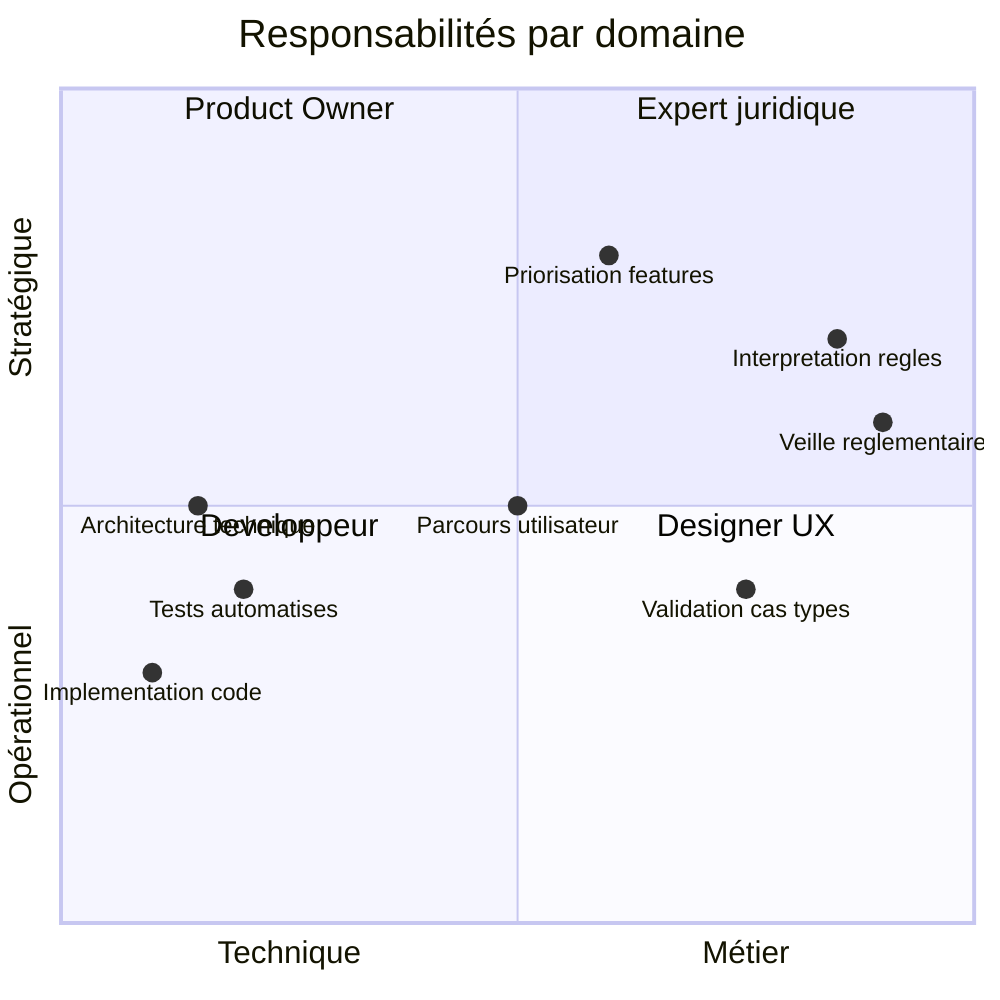

---

### 3.3 Cycle de vie d'une règle

**Usage** : Visualiser les états d'une règle dans le système.

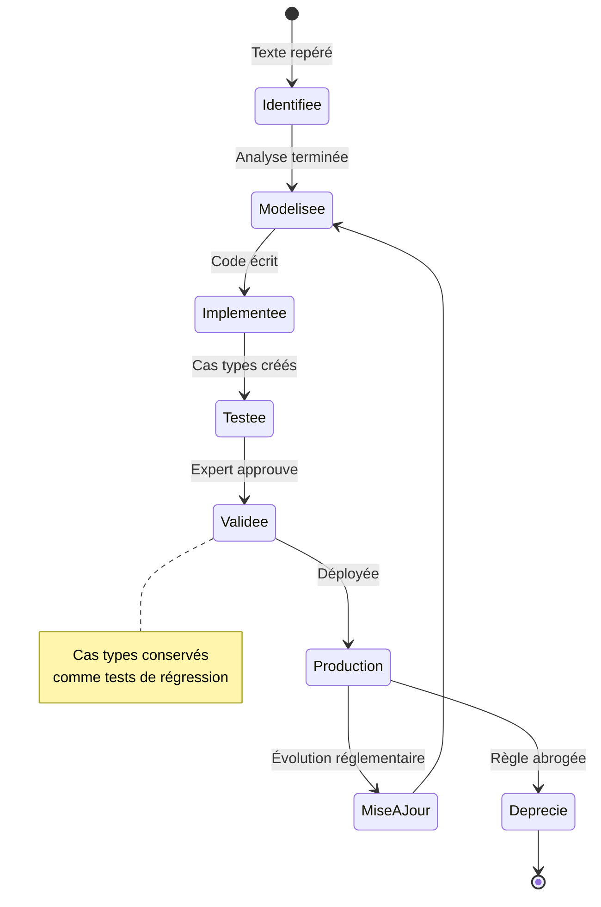

---

## 4. TRAÇABILITÉ

### 4.1 Carte de correspondance texte → code

**Usage** : Tableau de traçabilité pour audit.

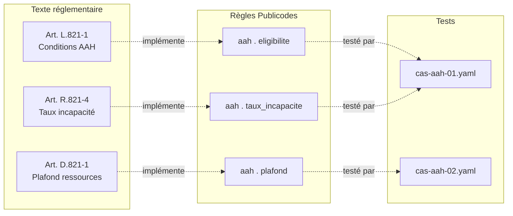

---

### 4.2 Diagramme de conformité

**Usage** : Dashboard visuel de couverture réglementaire.

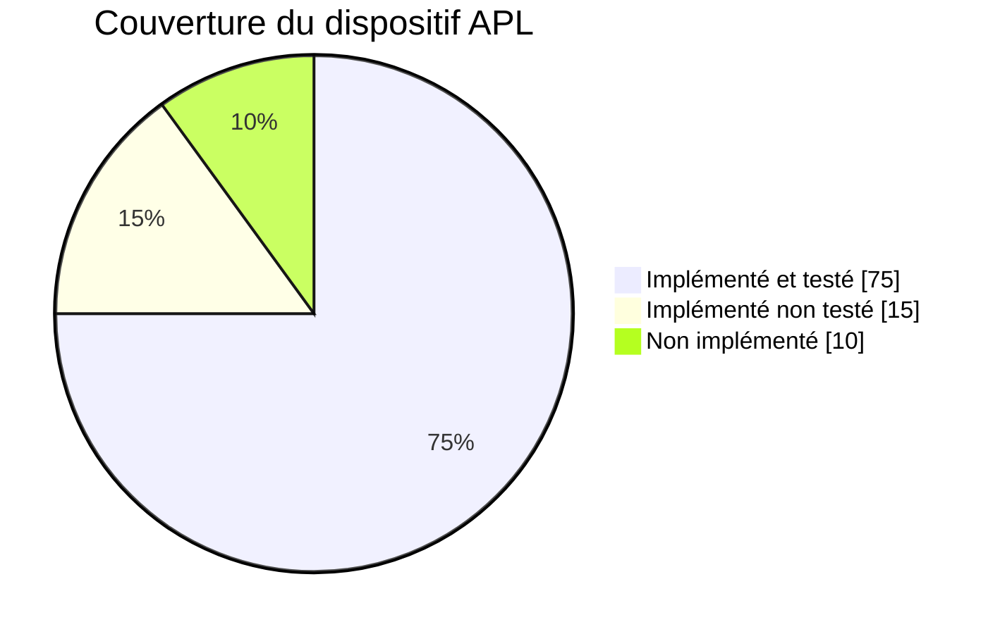

---

### 4.3 Historique des interprétations

**Usage** : Documenter les choix d'interprétation dans le temps.

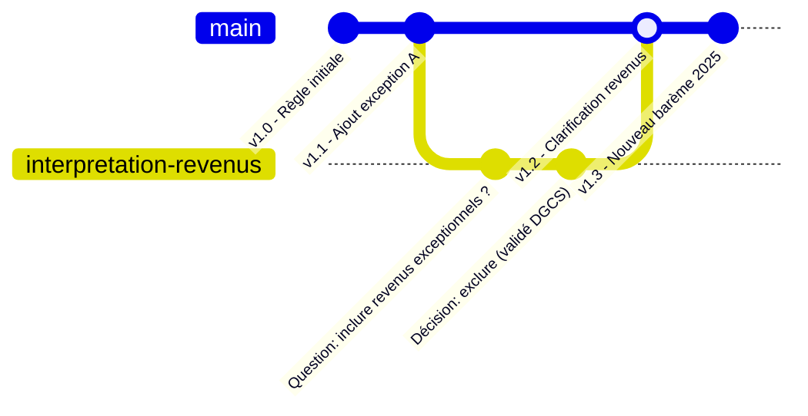

---

## 5. PARCOURS UTILISATEUR

### 5.1 Funnel de simulation

**Usage** : Analyser les abandons dans le parcours.

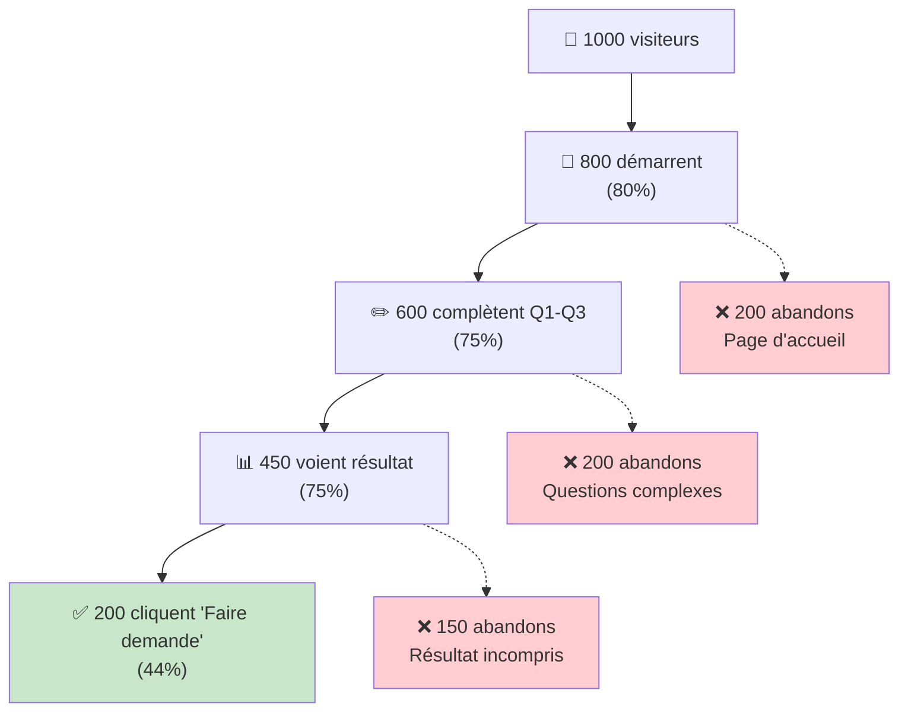

---

### 5.2 Parcours conditionnel

**Usage** : Documenter la logique de branchement du formulaire.

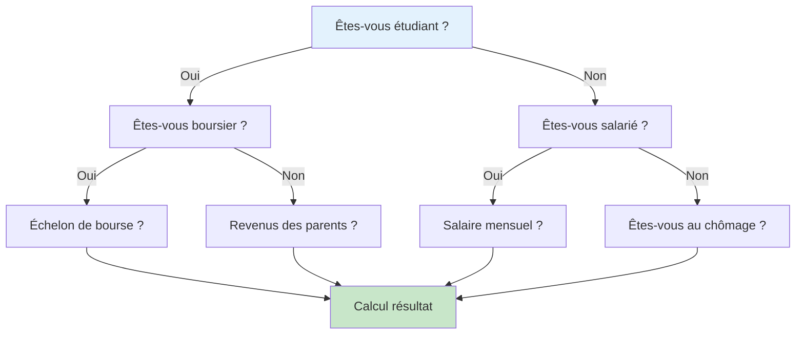

---

## 6. TEMPLATES RÉUTILISABLES

### 6.1 Template générique d'aide

Copier-coller ce template pour documenter une nouvelle aide :

```markdown
## [NOM DE L'AIDE]

### Références légales
- Article principal : [LIEN LÉGIFRANCE]
- Décret d'application : [LIEN]
- Circulaire : [LIEN]

### Arbre de décision

\`\`\`mermaid
flowchart TD
    START((Début)) --> C1{[CONDITION_1] ?}
    C1 -->|Oui| C2{[CONDITION_2] ?}
    C1 -->|Non| REJECT[❌ Non éligible]
    C2 -->|Oui| ELIGIBLE[✅ Éligible]
    C2 -->|Non| REJECT
\`\`\`

### Variables

| Variable | Type | Source | Période |
|----------|------|--------|---------|
| [var_1] | nombre | Saisie | N |
| [var_2] | booléen | Calculé | N-1 |

### Cas types de validation

| Cas | Situation | Résultat attendu | Validé par |
|-----|-----------|------------------|------------|
| 001 | [description] | Éligible, 150€ | [expert] |
| 002 | [description] | Non éligible | [expert] |
```

---

### 6.2 Checklist visuelle de conformité

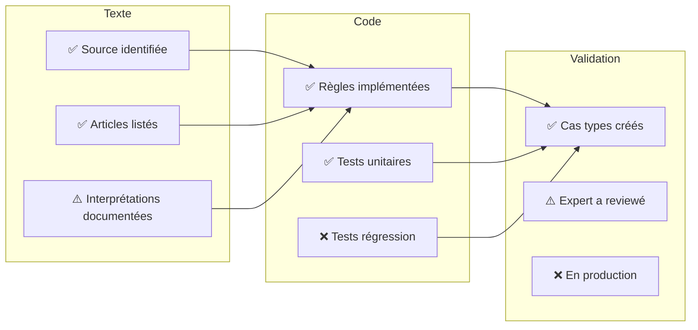

---

## 7. RESSOURCES COMPLÉMENTAIRES

### Outils recommandés

| Outil | Usage | Format |
|-------|-------|--------|
| **Mermaid** | Diagrammes versionnables | Code dans Markdown |
| **Excalidraw** | Schémas collaboratifs rapides | SVG/PNG |
| **Figma** | Maquettes UI, design system | Figma |
| **Whimsical** | Flowcharts, wireframes | Cloud |
| **draw.io** | Diagrammes techniques | XML/SVG |

### Intégrations

- **VitePress** : Support Mermaid natif avec plugin
- **GitHub** : Rendu Mermaid dans les Markdown
- **Notion** : Embed via code block
- **Confluence** : Plugin Mermaid

### Bonnes pratiques

1. **Versionner les diagrammes** : Préférer Mermaid (code) à des images
2. **Lier aux sources** : Ajouter des liens cliquables vers Légifrance
3. **Maintenir à jour** : Un diagramme obsolète est pire que pas de diagramme
4. **Simplifier** : Un diagramme doit clarifier, pas complexifier
5. **Tester le rendu** : Vérifier sur différents supports (web, PDF, print)

---

## Voir aussi

- [Patterns architecturaux](/02_ecosysteme/03_patterns)
- [Collaboration métier-produit](/02_ecosysteme/04_collaboration)
- [Modéliser une aide](/01_simulateurs/02_modeliser-une-aide)
