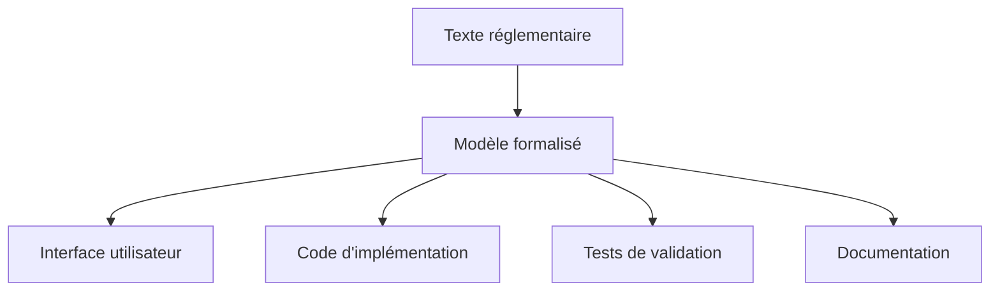

# Pourquoi c'est important de modéliser des règles ?

La modélisation des règles d'aides publiques n'est pas qu'un exercice technique : c'est un enjeu démocratique et d'égalité d'accès aux droits.

## Une règle modélisée, c'est une règle qu'on peut comprendre, tester et faire évoluer

Modéliser une règle, c'est la traduire depuis un texte juridique ou administratif vers un **langage logique, structuré, interprétable par un ordinateur**.

Cela permet de rendre les critères d'éligibilité :

### 🔍 Explorables
*Quelles sont les conditions exactes ?*

La modélisation force à expliciter toutes les conditions, même celles qui pourraient être implicites dans le texte original.

### ✅ Vérifiables  
*Quel traitement est appliqué à quel profil ?*

On peut tester systématiquement différents profils et vérifier que les résultats correspondent aux attentes.

### 📚 Documentables
*À quelles sources la règle renvoie ?*

Chaque variable et condition peut être tracée jusqu'à sa source réglementaire.

### 🔄 Réutilisables
*Dans un simulateur, un chatbot, une API...*

Une fois modélisée, la règle peut être utilisée dans différents contextes et interfaces.

### 🛠️ Maintenables
*Facilite les mises à jour réglementaires*

Les évolutions peuvent être intégrées de manière contrôlée et transparente.

### ⚖️ Garantes d'égalité
*Même traitement pour tous*

Élimine les variations d'interprétation entre agents ou services.

## On n'a pas le choix de le faire, à partir du moment où on vit dans un monde numérique

### L'informatisation est déjà là

Que nous le voulions ou non, la plupart des aides publiques sont déjà gérées par des systèmes informatiques. La question n'est pas de savoir **si** on doit modéliser, mais **comment** on le fait.

### Modélisation implicite vs explicite

Dans de nombreux systèmes existants, les règles sont :
- **Enfouies dans le code** sans documentation
- **Éclatées** entre plusieurs systèmes  
- **Non vérifiables** par les experts métier
- **Difficiles à maintenir**

Notre approche vise à rendre cette modélisation **explicite** et **collaborative**.

## Ce travail permet de sortir du flou → redevabilité

### Le problème du flou réglementaire

Dans de nombreux cas, les règles sont appliquées sans être formalisées. Ce flou peut générer :
- **Traitements inéquitables** selon l'agent ou le service
- **Erreurs** d'interprétation  
- **Pertes de droits** pour les usagers
- **Difficultés** de contrôle et d'audit

### La modélisation comme outil de transparence

Modéliser, c'est mettre à plat : 
- Quels sont les critères retenus ? 
- Comment sont-ils définis ? 
- Que se passe-t-il dans tel ou tel cas ?

On passe d'une **règle implicite** à une **règle visible et partageable**.

### Exemple concret

**Avant modélisation** :
> "L'aide est accordée aux familles en difficulté"

**Après modélisation** :
- Famille = foyer fiscal + enfants à charge
- Difficulté = revenus < 60% du SMIC pour 2 adultes + X€ par enfant
- Calcul du montant = (plafond - revenus) × 0.8
- Plafonnement à Y€ par mois

## Multidisciplinaire → un langage commun entre les métiers

### Le défi de la communication

Dans un produit dédié à un dispositif d'aide publique interviennent :
- **Experts métier** : connaissent les règles mais pas forcément la technique
- **Juristes** : maîtrisent les textes mais pas l'UX
- **Designers** : pensent parcours utilisateur mais pas réglementation
- **Développeurs** : implémentent mais ne connaissent pas le métier

### La modélisation comme langage commun

La modélisation permet de créer une **base compréhensible par toutes les parties prenantes** :

### Outils de dialogue

- **Arbres de décision** : compréhensibles par tous
- **Tableaux de variables** : structurent les échanges
- **Scénarios de test** : valident la compréhension commune
- **Prototypes interactifs** : testent l'expérience globale

## Exemples d'impact

### Réduction des erreurs

**Avant** : 15% d'erreurs dans le calcul manual de l'aide X
**Après** : 0.5% d'erreurs (uniquement liées aux cas non modélisés)

### Harmonisation des pratiques

**Avant** : Variations de +/- 30% entre départements sur les mêmes critères
**Après** : Application uniforme des règles

### Amélioration de l'accès aux droits

**Avant** : 40% de non-recours sur l'aide Y
**Après** : 15% de non-recours (simulateur proactif)

## Limites et précautions

### Ce que la modélisation ne fait pas

- **Ne remplace pas l'expertise humaine** pour les cas complexes
- **Ne dispense pas d'un accompagnement** pour les publics en difficulté
- **N'élimine pas totalement** la subjectivité (choix de modélisation)

### Risques à éviter

- **Sur-simplification** : ignorer des cas importants pour simplifier
- **Techno-solutionnisme** : croire que la technique résout tous les problèmes
- **Exclusion numérique** : oublier les publics non connectés

::: warning Important
La modélisation doit toujours être au service de l'égalité d'accès aux droits, pas une fin en soi.
:::

## Prochaines étapes

- [Découvrir comment passer du modèle au code](/simulateurs/passer-en-code)
- [Apprendre à tester et valider un modèle](/simulateurs/tester-ajuster)
- [Comprendre les enjeux de maintenance](/simulateurs/maintenir)
