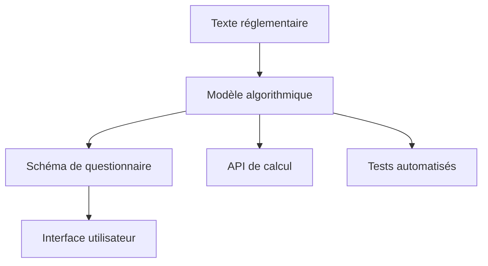

# Passer le modèle de règle en code

Une fois le modèle conceptuel défini, il faut l'implémenter techniquement. Cette étape nécessite de faire des choix entre deux modélisations complémentaires.

## Glossaire des concepts clés

**Modéliser un dispositif** : Traduire un texte réglementaire écrit en langage naturel/juridique en langage formel (logique mathématique, organigramme, algorithme...)

**Un dispositif** : Une ou plusieurs règles qui ensemble visent à régir une situation particulière ou produire un effet juridique précis. *Exemple : aide personnalisée au logement*

**Une règle** : Une portion d'un texte réglementaire (une ou plusieurs *mesures*) que l'on peut identifier comme étant une instruction émise par les législateurs. *Exemple : règle d'éligibilité d'une personne à l'APL en cas de location en foyer*

## Deux modélisations complémentaires

Pour un simulateur, deux modélisations complémentaires sont réalisées :

### 🟣 Modélisation algorithmique des règles

**Objectif** : Modélisation fidèle à la réglementation officielle, indépendante du public du simulateur.

**Caractéristiques** :
- Modélisation formelle
- Fidélité maximale au texte réglementaire  
- Indépendante de l'interface utilisateur
- Réutilisable dans différents contextes

**Enjeux** :
- **Fiabilité** : Résultats conformes à la réglementation
- **Maintenabilité** : Facilité de mise à jour suite aux évolutions réglementaires
- **Auditabilité** : Traçabilité des calculs

### 🔵 Modélisation du parcours utilisateur

**Objectif** : Modélisation adaptée au public du simulateur pour le recueil des informations.

**Caractéristiques** :
- Adaptation au public visé
- Simplification possible de la réglementation
- Optimisation pour l'expérience utilisateur
- Parcours fluide et compréhensible

**Enjeux** :
- **Flexibilité** : Adaptation aux différents publics
- **Clarté** : Compréhension par le public visé  
- **Efficacité** : Parcours réalisable en un temps raisonnable

## Questions préalables à se poser

### Définir le contexte d'usage

- **Quel public destinataire ?** (Grand public, professionnels, institutions)
- **Quel usage de la modélisation ?** (Simulation individuelle, simulation budgétaire, analyse prospective)
- **Quel niveau d'exigence UX ?** (Très fluide vs très précis)
- **Quelle temporalité ?** (Règles actuelles, passées, futures)

### Choisir son "consommateur"/output

- **Simulateur avec questionnaire** : Interface web interactive
- **Dashboard en temps réel** : Calculs batch sur populations
- **API de calcul** : Intégration dans d'autres services
- **Préremplissage** : Aide à la saisie dans des formulaires

## Différences entre moteurs de règles

### OpenFisca

**Points forts** :
- Modélisation très fidèle au droit fiscal et social français
- Gestion fine des temporalités et évolutions
- Large écosystème existant (impôts, prestations sociales)
- Calculs batch performants

**Points faibles** :
- Courbe d'apprentissage élevée
- Verbosité du code
- Moins adapté aux règles métier spécifiques

**Cas d'usage typique** : Simulation fiscale ou sociale complexe

### Publicodes

**Points forts** :
- Syntaxe proche du langage naturel
- Facilité de prise en main
- Bonne expressivité pour les règles métier
- Édition collaborative facilitée

**Points faibles** :
- Écosystème plus restreint
- Moins de fonctionnalités avancées
- Performance moindre sur gros volumes

**Cas d'usage typique** : Simulateur d'aide spécifique, règles métier

## Exemple pratique : Mobili-jeunes

Prenons l'exemple de l'aide Mobili-jeunes et voyons comment elle se décline selon les moteurs.

### Règle simplifiée
> "Aide de 100€/mois max pour les apprentis de moins de 30 ans, plafonnée à 10€/m² de loyer"

### Implémentation OpenFisca

```python
class mobili_jeunes_eligibilite(Variable):
    value_type = bool
    entity = Individu
    definition_period = MONTH
    
    def formula(individu, period):
        age = individu('age', period)
        apprenti = individu('apprenti', period)
        return (age < 30) * apprenti

class mobili_jeunes_montant(Variable):
    value_type = float
    entity = Menage
    definition_period = MONTH
    
    def formula(menage, period):
        eligible = menage.sum(menage.members('mobili_jeunes_eligibilite', period))
        loyer = menage('loyer', period)
        surface = menage('surface_logement', period)
        
        montant_base = 100
        plafond_loyer = surface * 10
        
        return eligible * min(montant_base, plafond_loyer)
```

### Implémentation Publicodes

```yaml
mobili-jeunes . éligibilité:
  formule:
    toutes ces conditions:
      - âge < 30
      - apprenti = oui

mobili-jeunes . montant:
  formule:
    le minimum de:
      - 100 €/mois
      - surface logement * 10 €/m²
  applicable si: mobili-jeunes . éligibilité
```

## Du modèle au schéma de questionnaire

### Quand le modèle suffit-il ?

Le modèle algorithmique peut directement générer les questions si :
- Les variables sont simples à expliquer
- L'ordre de saisie importe peu
- Pas d'optimisation UX spécifique nécessaire

### Quand passer par un schéma intermédiaire ?

Il faut créer un schéma spécifique quand :
- **Simplification nécessaire** : Le questionnaire n'entre pas dans le détail de toutes les informations du modèle
- **Optimisation du parcours** : Ordonnancement spécifique des questions
- **Adaptation au public** : Reformulation des concepts juridiques

### Format de schéma (exemple aides-simplifiees)

```json
{
  "questions": [
    {
      "id": "age",
      "type": "number",
      "label": "Quel est votre âge ?",
      "help": "Votre âge au moment de la demande",
      "variable_mapping": "individu.age",
      "validation": {
        "min": 16,
        "max": 99
      }
    },
    {
      "id": "formation",
      "type": "choice",
      "label": "Suivez-vous une formation en apprentissage ?",
      "choices": [
        {"value": true, "label": "Oui"},
        {"value": false, "label": "Non"}
      ],
      "variable_mapping": "individu.apprenti",
      "condition": "age < 30"
    }
  ]
}
```

## Critères de choix technique

### Exigence UX forte
→ Schéma intermédiaire + optimisation du parcours

### Arbre de décision profond/large
→ Modélisation avec conditions complexes

### Besoin d'explicabilité
→ Moteur avec capacités de trace (Publicodes)

### Contraintes de temps
→ Optimisation du nombre de questions

### Précision des résultats
→ Fidélité maximale au modèle réglementaire

### Usage ultérieur des résultats
→ API standardisée pour réutilisation

## Bonnes pratiques

### Séparation des responsabilités



### Documentation et traçabilité

- **Mapping** : Correspondance variable ↔ article de loi
- **Tests** : Scénarios de validation
- **Versionning** : Suivi des évolutions
- **Explicabilité** : Chemin de calcul accessible

### Évolutivité

- **Séparation données/logique** : Barèmes externalisés
- **Modularité** : Règles indépendantes quand possible
- **Configuration** : Paramétrage sans modification de code

::: tip Conseil pratique
Commencez toujours par la modélisation algorithmique pure avant d'optimiser l'expérience utilisateur. Cela garantit la cohérence réglementaire.
:::

## Prochaines étapes

- [Apprendre à tester et valider son modèle](/simulateurs/tester-ajuster)
- [Comprendre les enjeux de maintenance](/simulateurs/maintenir)
- [Découvrir les outils et bonnes pratiques](/glossaire)
