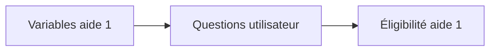
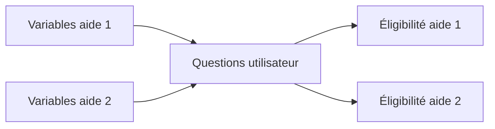
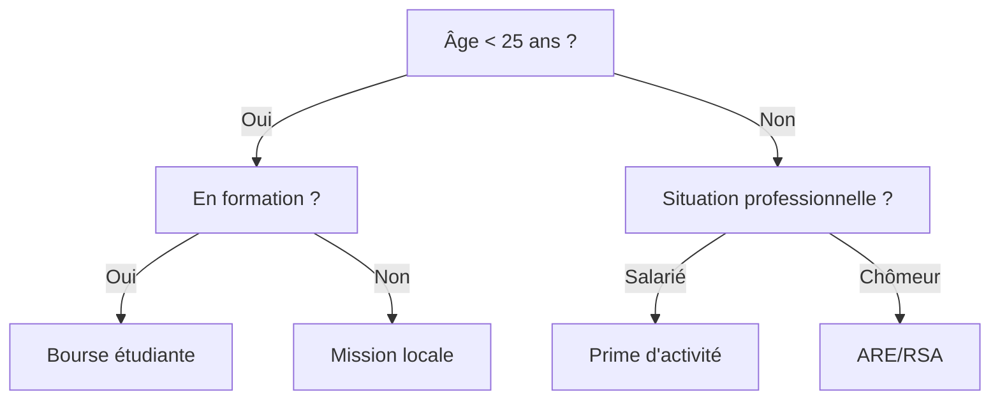
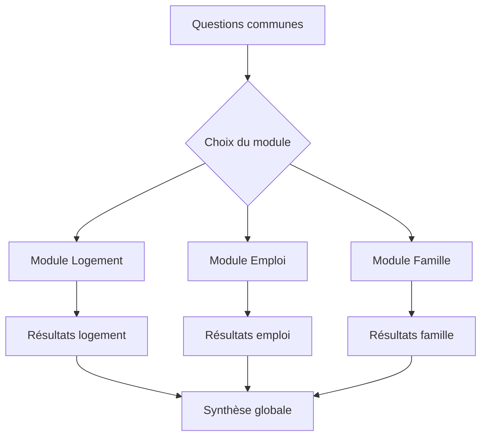

# Concevoir un simulateur multi-aide

Combiner plusieurs aides dans un même simulateur présente des avantages évidents pour l'utilisateur, mais soulève de nombreux défis techniques et méthodologiques.

## Pourquoi un simulateur multi-aide ?

### Avantages pour l'utilisateur

Dans l'exercice précédent (modélisation d'une seule aide), il est relativement facile de passer de la liste des variables dont on a besoin à une suite de questions à poser à l'utilisateur.

Il peut être intéressant de calculer l'éligibilité à plusieurs aides au sein d'un même parcours :

- **Du point de vue de l'utilisateur** : permet de découvrir les aides auxquelles on a droit à partir de la description de sa situation, plutôt que de partir d'une aide existante (qu'on ne connaît pas forcément)

### Optimisation du parcours

Cependant, en combinant plusieurs aides dans un seul parcours, la liste des questions peut devenir laborieuse pour l'utilisateur. On cherche à **minimiser le nombre de questions**, ce qui peut entraîner un certain nombre de difficultés.

## Les tensions à gérer

### 1. Variables hétérogènes

**Problème** : Chaque aide repose sur ses propres définitions (revenu, foyer, situation professionnelle...) qui ne se superposent pas toujours.

**Exemple** : La notion de "revenu" au sens de l'aide logement est différente de la notion de "revenu" au sens du RSA.

**Arbitrage** : 
- Soit on utilise les notions de chaque aide → parcours plus lourd
- Soit on les harmonise → perte de précision

### 2. Cumulabilité des aides

**Problème** : Certaines aides sont cumulables entre elles, d'autres non. Il faut gérer ces interdépendances.

**Exemple** : L'APL peut réduire le montant du RSA, mais pas celui de certaines bourses étudiantes.

### 3. Exhaustivité réglementaire vs fluidité du parcours

**Problème** : Certaines questions couvrent des cas particuliers extrêmement minoritaires ou ayant des impacts mineurs sur l'éligibilité.

**Arbitrage** : Ne pas les inclure peut réduire le taux d'abandon, mais diminue la précision.

### 4. Langage clair vs langage juridique

**Problème** : Chercher à améliorer la clarté d'une question peut faire perdre en exactitude réglementaire.

**Exemple** : Lors de tests utilisateurs, la notion juridique "X" n'est pas comprise. Reformulée en "Y", elle l'est plus mais n'est pas aussi précise juridiquement.

## Les solutions

### Principe général

Il n'existe pas de méthode toute faite pour concilier ces tensions. **Le compromis est à construire** en mobilisant différents outils et en faisant dialoguer différents métiers autour de ces objets : juriste, designer, développeur, responsable produit.

Il s'agira d'**itérer entre deux pôles** :

1. **Les règles de calcul et leurs exigences** (identification des variables nécessaires à chaque éligibilité)
2. **Le parcours utilisateur** (ordonnancement des questions, formulations, raccourcis...)

## Les outils à mobiliser

### Représentations visuelles

Les **arbres logiques** peuvent servir d'objet de dialogue entre les différents métiers.

Plusieurs types possibles en fonction de la complexité :

#### Arbre de décision simple
Pertinent pour des cas simples, peu d'aides ou qui se superposent bien.

#### Carte visuelle des variables
Représentation du parcours UX avec questions et affichages conditionnels.

#### Outils d'édition
- **Éditeurs visuels** (Lucidchart, Figma, Miro) : manipulation par des non-techniques
- **Éditeurs Mermaid** : manipulation facilitée par LLM, versionnage

### Personas

Poser des **personas** et passer les arbres construits à leur prisme permet d'identifier :
- D'éventuelles redondances d'un point de vue UX
- Des points superflus
- Des reformulations nécessaires

**Exemple de persona** :
> "Marie, 24 ans, étudiante en master, vit en colocation, travaille 10h/semaine, parents séparés"

### Grille d'arbitrage

Pour **documenter les choix** faits (fusion de questions, suppression, simplifications, etc.).

| Question originale | Problème identifié | Solution retenue | Impact | Validation |
|-------------------|-------------------|------------------|---------|------------|
| "Êtes-vous en formation initiale ou continue ?" | Distinction pas claire pour les utilisateurs | Fusionné en "Êtes-vous étudiant ?" | Perte de précision pour 5% des cas | Validé par expert métier |

## Exemple détaillé : modélisation croisée de trois aides logement

### Contexte
Modélisation croisée des APL + aide départementale + aide municipale au logement.

### Ce qu'on a fait

#### 1. Table de correspondance des variables

| Variable métier | APL | Aide départ. | Aide municipale | Question unique possible ? |
|----------------|-----|--------------|-----------------|---------------------------|
| Revenu foyer | Revenus N-1 | Revenus N-2 | Revenus actuels | ❌ Non |
| Type logement | Location/propriété | Location seule | Tous types | ✅ Oui (plus large) |
| Zone géographique | Zone APL | Code postal | Quartier prioritaire | ❌ Non |

#### 2. Détection des incohérences + redondances

- **Incohérence** : Période de référence des revenus différente
- **Redondance** : Type de logement (concepts compatibles)

#### 3. Fusion ou regroupement des questions

- **Fusion réussie** : "Type de logement" → question unique
- **Séparation maintenue** : Revenus → 3 questions distinctes mais groupées

#### 4. Scénarisation avec différents profils utilisateurs

Test du parcours avec 5 personas représentatives pour identifier les points de friction.

## Bonnes pratiques

### Partir des règles
Toujours partir des règles pour savoir ce qui est **strictement nécessaire** avant d'optimiser l'UX.

### Factoriser intelligemment
Factoriser autant que possible les questions **sans perdre de sens métier**.

### Tracer les arbitrages
Pour maintenir la lisibilité et faciliter les mises à jour futures.

### Modularité
Ne pas hésiter à créer des **parcours modulaires** : certains dispositifs peuvent être simulés « en option ».

## Architecture modulaire suggérée

::: tip Conseil pratique
Commencez par identifier les variables communes (âge, situation familiale, revenus) avant de traiter les spécificités de chaque aide.
:::

## Prochaines étapes

- [Comprendre l'importance de la modélisation](/simulateurs/importance-modelisation)
- [Implémenter techniquement le simulateur](/simulateurs/passer-en-code)
- [Tester et valider les choix effectués](/simulateurs/tester-ajuster)
