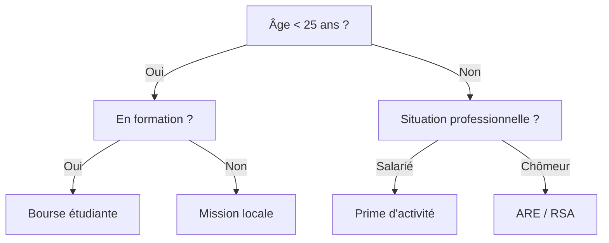
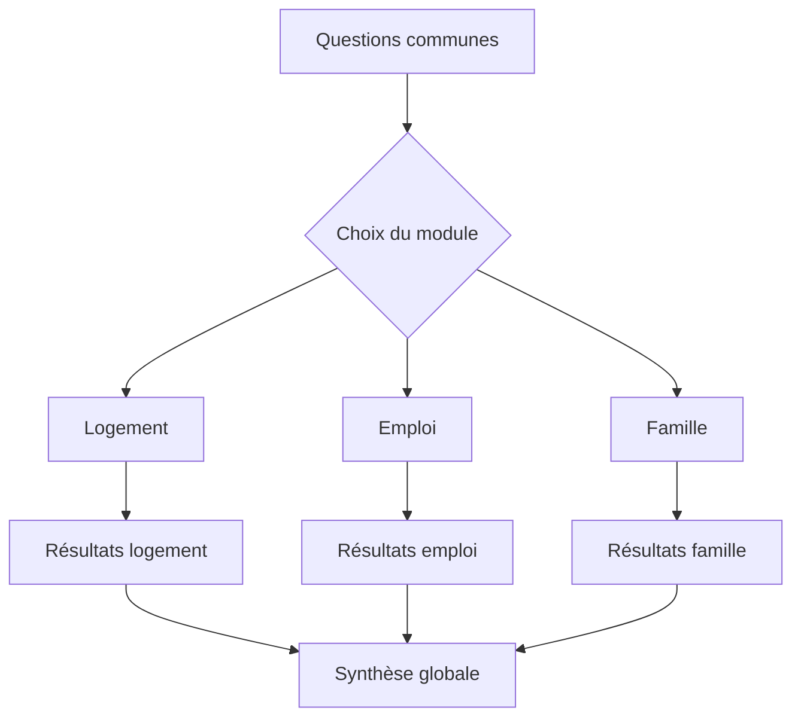

# Concevoir un simulateur multi-aide

Construire un simulateur combinant plusieurs aides publiques, c’est passer de la modélisation isolée à la **composition de règles hétérogènes**. Chaque aide a ses propres critères, barèmes et exceptions. Les regrouper dans un même outil suppose de **faire cohabiter plusieurs logiques administratives** sans créer de contradiction.

Combiner plusieurs aides dans un même simulateur présente des avantages évidents pour l'utilisateur, mais soulève de nombreux défis techniques et méthodologiques.

## Pourquoi mutualiser les aides ?

Les usagers ne pensent pas “par dispositif”, mais **par besoin** : se loger, se former, se déplacer, élever un enfant. Un simulateur multi-aide vise donc à **répondre à des situations de vie**, non à des silos administratifs.

Concevoir un simulateur multi-aide, c’est relever plusieurs défis :
- **Réunir plusieurs modèles d’aides** dans un seul parcours cohérent ;
- **Mutualiser les variables communes** (revenus, âge, résidence, statut familial) ;
- **Simplifier la saisie** pour éviter la redondance d’information ;
- **Garantir la cohérence des résultats** entre les différentes aides.

> Le multi-aide est l’expression la plus concrète du Rules as Code : un écosystème de règles interopérables, pas une collection de simulateurs.

## 1. Identifier les variables communes

Les aides partagent un certain nombre de **variables transverses**.  
Avant d’assembler les modèles, il faut recenser ces variables et définir une **grammaire commune**.

| Domaine | Exemple de variable | Type | Commentaire |
|----------|--------------------|-------|--------------|
| Identité | âge, nationalité | entrée | Doit suivre les mêmes définitions légales pour toutes les aides |
| Ressources | revenus_annuels, quotient_familial | calculée | À centraliser dans un module “ressources” |
| Situation familiale | enfants_a_charge, rattachement_fiscal | booléen | Critères sensibles, souvent divergents selon les aides |
| Logement | type_logement, résidence_principale | booléen | Sert à plusieurs aides (APL, énergie, mobilité) |
| Territoire | code_insee, zone_tendue | référence | Permet les différenciations locales |

Chaque variable commune doit être définie **une seule fois** dans un référentiel partagé, puis appelée dans chaque modèle d’aide.

## 2. Résoudre les tensions

### Les variables hétérogènes

Chaque aide repose sur ses propres définitions (revenu, foyer, situation professionnelle...) qui ne se superposent pas toujours.

**Exemple** : La notion de "revenu" au sens de l'aide logement est différente de la notion de "revenu" au sens du RSA.

**Arbitrage** :
- Soit on utilise les notions de chaque aide, ce qui complexifie le parcours utilisateur
- Soit on les harmonise, ce qui peut entraîner des imprécisions de calcul

**Bonnes pratiques** :
- créer un **dictionnaire de correspondance** entre les noms de variables (`revenus_annuels`, `revenu_net_imposable`, etc.) ;
- documenter les divergences d’interprétation (ex. : “étudiant” ≠ “apprenti”) ;
- isoler les “zones grises” dans un fichier dédié.

### Les conflits de règles

Plusieurs aides peuvent se chevaucher ou se contredire. Ces situations doivent être anticipées.

**Types de conflits fréquents :**
- **Non-cumul légal** (ex. : deux aides au logement exclusives) ;  
- **Calcul en cascade** (une aide dépend du montant d’une autre) ;  
- **Conditions contradictoires** (critères de résidence ou d’âge différents).

**Stratégies de résolution** :
| Type de conflit | Solution recommandée |
|------------------|----------------------|
| Non-cumul | Créer une variable `cumul_autorise` et l’exposer à l’usager |
| Calcul en cascade | Définir une hiérarchie d’évaluation (`ordre_execution`) |
| Conditions divergentes | Documenter la différence et afficher une note explicative |

> L’objectif est moins de masquer les contradictions que de les rendre explicites.

## 3. Concevoir le parcours utilisateur

Dans l'exercice précédent (modélisation d'une seule aide), il est relativement facile de passer de la liste des variables dont on a besoin à une suite de questions à poser à l'utilisateur 

Cependant, en combinant plusieurs aides dans un seul parcours, la liste des questions peut devenir laborieuse pour l'utilisateur. On cherche à **minimiser le nombre de questions et à bien les ordonner**, ce qui peut entraîner un certain nombre de difficultés.

### Exhaustivité réglementaire vs fluidité du parcours

Certaines questions couvrent des cas particuliers extrêmement minoritaires ou ayant des impacts mineurs sur l'éligibilité.Ne pas les inclure peut réduire le taux d'abandon, mais diminue la précision.

### Langage clair vs langage juridique

**Problème** : Chercher à améliorer la clarté d'une question peut faire perdre en exactitude réglementaire.

**Exemple** : Lors de tests utilisateurs, la notion juridique "X" n'est pas comprise. Reformulée en "Y", elle l'est plus mais n'est pas aussi précise juridiquement.

## Itération entre règles et UX

Il n'existe pas de méthode toute faite pour concilier l'ensemble de ces tensions. **Le compromis est à construire** en mobilisant différents outils et en faisant dialoguer différents métiers autour de ces objets : juriste, designer, développeur, responsable produit.

Il s'agira d'**itérer entre deux pôles** :

1. **Les règles de calcul et leurs exigences** (identification des variables nécessaires à chaque éligibilité)
2. **Le parcours utilisateur** (ordonnancement des questions, formulations, raccourcis...)

## Les outils et représentations mobiliser

Les représentations visuelles jouent un rôle central dans la conception. Elles rendent visibles les interactions entre modèles et facilitent le dialogue entre juristes, designers et développeurs.

### Arbres logiques

Les arbres de décision sont adaptés aux aides simples ou bien superposables.

### Carte visuelle des variables

Les cartes visuelles de variables permettent de représenter les questions, conditions et affichages selon les scénarios.  
Les éditeurs comme **Lucidchart**, **Figma** ou **Miro** facilitent la collaboration.   **Mermaid**, en revanche, permet un versionnage textuel et une maintenance automatisée.

## Approche centrée sur les profils

Les personas servent à tester les arbres et à identifier les redondances ou incompréhensions.  
Ils aident à repérer les zones de friction avant la phase technique.

> Exemple : *Marie, 24 ans, étudiante en colocation, travaille dix heures par semaine, parents séparés.*

Cette méthode contribue à ajuster la granularité des questions et à vérifier la cohérence du parcours.

## Grille d'arbitrage

Chaque décision de simplification ou de fusion doit être documentée. Une grille d’arbitrage permet de garder trace des compromis entre précision réglementaire et lisibilité.

| Question originale | Problème identifié | Solution retenue | Impact | Validation |
|--------------------|-------------------|------------------|---------|------------|
| “Formation initiale ou continue ?” | Distinction peu claire | Fusionnée en “Êtes-vous étudiant ?” | Perte mineure de précision | Validé par expert métier |

[[note: Ce tableau formalise les choix structurants du parcours et contribue à la traçabilité.]]

## Étude de cas : modélisation croisée d’aides logement

La modélisation croisée des **APL**, d’une **aide départementale** et d’une **aide municipale** illustre la complexité de l’intégration.

### Correspondance des variables

| Variable | APL | Aide départementale | Aide municipale | Question commune ? |
|-----------|-----|--------------------|-----------------|--------------------|
| Revenu foyer | N-1 | N-2 | Actuel | ❌ |
| Type logement | Location/propriété | Location seule | Tous types | ✅ |
| Zone géographique | Zone APL | Code postal | Quartier prioritaire | ❌ |

**Analyse** :
- Des incohérences portent sur les périodes de revenus.
- Des redondances concernent le type de logement, consolidable en une seule question. Certaines divergences subsistent mais sont explicitées dans la documentation.

**Validation**
- Les arbitrages sont testés sur plusieurs profils représentatifs.
- Cette validation permet de vérifier la pertinence du parcours sans perte de sens métier.

## Principes de conception

Un simulateur multi-aide repose sur quatre principes :

1. Partir des règles pour déterminer les informations indispensables.  
2. Factoriser intelligemment les questions en altérant le moins possible la signification juridique.  
3. Tracer les arbitrages pour maintenir la lisibilité et la réversibilité.  
4. Conserver la modularité : certaines aides peuvent être simulées en option.

Ces principes assurent l’équilibre entre rigueur et accessibilité.

### Groupement des questions

### Restitution et expérience utilisateur

Le simulateur ne se limite pas aux résultats d'éligibilités et de monter : il doit aussi proposer une **restitution claire et segmentée**.

Par ailleursn, quelques bonnes pratiques :
- La restitution doit refléter la clarté du calcul et la provenance des données.
- Les résultats gagnent en lisibilité lorsqu’ils sont regroupés par **thématique de vie** plutôt que par organisme.
- Chaque aide doit mentionner sa **source réglementaire** et ses **conditions d’incertitude**.
- Un résumé synthétique, exportable ou imprimable, renforce la transparence.

> La restitution est l’acte final de confiance entre système et usager.

## Gouvernance et maintenance

Un simulateur multi-aide suppose une gouvernance claire. La mutualisation ne peut fonctionner sans :
- un référentiel centralisé des variables communes ;  
- une validation croisée entre porteurs d’aides ;  
- une traçabilité complète des arbitrages et anomalies corrigées.

Chaque mise à jour individuelle doit être testée sur l’ensemble multi-aide afin d’éviter les effets de bord. La maintenance devient ainsi un exercice collectif de cohérence réglementaire

## En résumé

Créer un simulateur multi-aide, c’est :
- penser en termes de **besoins d’usagers**, pas de dispositifs ;
- construire des **modèles interopérables** à partir de variables communes ;
- orchestrer des règles multiples de manière cohérente et transparente.