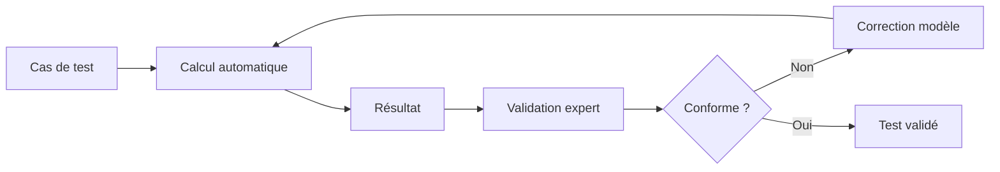
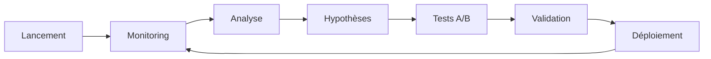

# Tester son modèle/simulateur et ajuster

Une fois le modèle implémenté, il est crucial de le valider pour s'assurer qu'il répond aux besoins des utilisateurs et respecte la réglementation.

## Types de tests à réaliser

### Tests automatisés/calcul avec expert métier

**Objectif** : Vérifier la conformité réglementaire et la fiabilité des calculs.

#### Tests de non-régression
- **Scénarios de référence** : Cas types validés par l'expert métier
- **Jeux de données historiques** : Comparaison avec calculs manuels existants
- **Tests limites** : Valeurs minimales, maximales, cas particuliers

#### Auditabilité avec expert métier



**Exemple de cas de test** :
```yaml
scenario: "Étudiant boursier en colocation"
input:
  age: 20
  statut: "étudiant"
  logement: "colocation"
  surface: 15
  loyer: 400
  revenus_parents: 25000
expected:
  apl_eligible: true
  apl_montant: 180
  aide_municipale_eligible: false
```

### Tests UX avec des usagers

**Objectif** : Valider l'expérience utilisateur et la compréhension du parcours.

#### Méthodes de test UX

##### Tests d'utilisabilité
- **Observation directe** : Utilisateur navigue pendant qu'on observe
- **Think aloud** : Utilisateur verbalise sa réflexion
- **Enregistrement d'écran** : Analyse des parcours a posteriori

##### Tests de compréhension
- **Questions ouvertes** : "Que comprenez-vous par cette question ?"
- **Reformulation** : "Pouvez-vous redire avec vos mots ?"
- **Exemples concrets** : "Dans votre situation, que répondriez-vous ?"

#### Indicateurs à mesurer

**Quantitatifs** :
- Taux d'abandon par étape
- Temps de parcours
- Taux d'erreur de saisie
- Taux de satisfaction (NPS)

**Qualitatifs** :
- Compréhension des questions
- Pertinence du résultat
- Confiance dans le calcul
- Clarté des explications

## Méthodologie de test

### Phase 1 : Tests internes

#### Validation technique
1. **Tests unitaires** : Chaque règle isolément
2. **Tests d'intégration** : Combinaison de règles
3. **Tests de performance** : Temps de calcul acceptable

#### Validation métier
1. **Revue par expert** : Juridique et métier
2. **Comparaison avec cas réels** : Dossiers traités manuellement
3. **Tests de cohérence** : Logique d'ensemble

### Phase 2 : Tests utilisateurs

#### Recrutement des testeurs
- **Représentatifs** du public cible
- **Diversité** des profils (âge, niveau d'étude, situation)
- **Volontaires** pour feedback détaillé

#### Protocole de test
```
1. Briefing (5 min) : Contexte sans révéler l'objectif précis
2. Parcours libre (15 min) : Navigation autonome
3. Débriefing (10 min) : Questions ouvertes
4. Test dirigé (10 min) : Scénarios spécifiques
5. Feedback (5 min) : Suggestions d'amélioration
```

### Phase 3 : Itération et ajustement

#### Analyse des résultats
- **Identification des points de friction** récurrents
- **Priorisation** selon l'impact utilisateur
- **Arbitrage** entre précision et simplicité

#### Ajustements possibles

**Sur le fond** :
- Modification des conditions d'éligibilité
- Ajout/suppression de variables
- Révision des calculs

**Sur la forme** :
- Reformulation des questions
- Réorganisation du parcours
- Amélioration des aides contextuelles

## Outils de test

### Outils techniques

#### Tests automatisés
- **Jest/Mocha** : Tests unitaires JavaScript
- **Pytest** : Tests Python
- **Cypress** : Tests end-to-end
- **Postman** : Tests d'API

#### Monitoring
- **Google Analytics** : Comportement utilisateur
- **Hotjar** : Heatmaps et enregistrements
- **Sentry** : Tracking des erreurs

### Outils UX

#### Tests à distance
- **UserTesting** : Tests utilisateurs en ligne
- **Maze** : Tests de parcours automatisés
- **Lookback** : Sessions d'entretien vidéo

#### Tests en présentiel
- **Caméra + micro** : Enregistrement des sessions
- **Grille d'observation** : Standardisation des retours
- **Prototype papier** : Tests de concepts précoces

## Exemples concrets de retours et ajustements

### Cas 1 : Question mal comprise

**Retour utilisateur** : 
> "Je ne comprends pas ce qu'est un 'foyer fiscal'"

**Analyse** : 
- 70% des testeurs bloquent sur cette notion
- Reformulation nécessaire

**Ajustement** :
```
Avant : "Quelle est la composition de votre foyer fiscal ?"
Après : "Qui déclarez-vous sur votre déclaration d'impôts ?"
+ Aide contextuelle avec exemples
```

### Cas 2 : Parcours trop long

**Retour utilisateur** :
> "Trop de questions, j'abandonne"

**Analyse** :
- Taux d'abandon de 45% à la question 12
- Questions redondantes identifiées

**Ajustement** :
- Fusion de 3 questions sur les revenus
- Suppression d'une question sur cas minoritaire (< 2%)
- Ajout d'une barre de progression

### Cas 3 : Résultat peu crédible

**Retour utilisateur** :
> "Le montant me paraît trop élevé"

**Analyse** :
- Calcul correct mais pas d'explication
- Manque de transparence sur la méthode

**Ajustement** :
- Ajout du détail de calcul
- Liens vers les textes de référence
- Mise en avant des conditions d'obtention

## Validation continue

### Monitoring post-lancement

**Indicateurs de santé** :
- Taux de conversion global
- Points de sortie fréquents  
- Temps de parcours moyen
- Retours SAV/support

### Boucle d'amélioration



### Tests A/B

**Exemples de tests** :
- Formulation de question (version A vs B)
- Ordre des questions
- Design de l'interface
- Texte d'explication

## Bonnes pratiques

### Ne jamais tester seul
- **Biais de conception** : On connaît trop bien son produit
- **Évidence trompeuse** : Ce qui nous paraît évident ne l'est pas forcément
- **Angle mort** : On ne voit pas ses propres erreurs

### Tester tôt et souvent
- **Prototype papier** : Avant même de coder
- **Tests itératifs** : À chaque évolution majeure
- **Feedback continu** : Monitoring permanent

### Équilibrer quantitatif et qualitatif
- **Données chiffrées** : Pour objectiver les problèmes
- **Verbatims** : Pour comprendre les causes
- **Observation** : Pour saisir l'implicite

### Documenter les choix
- **Rationale** : Pourquoi ce choix plutôt qu'un autre
- **Tests effectués** : Méthode et résultats
- **Compromis acceptés** : Ce qu'on a choisi de ne pas traiter

::: warning Attention aux biais
Les tests utilisateurs peuvent être biaisés par la formulation des questions ou le contexte. Variez les méthodes et les profils testeurs.
:::

## Prochaines étapes

- [Comprendre comment maintenir le simulateur dans le temps](/simulateurs/maintenir)
- [Explorer les outils et définitions techniques](/glossaire)
- [Découvrir l'historique des simulateurs publics](/historique)
